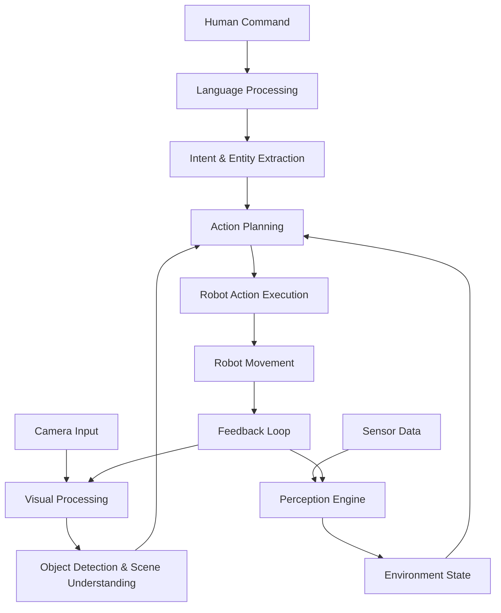
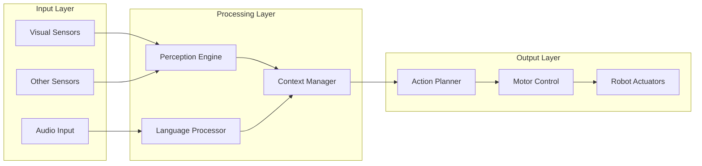
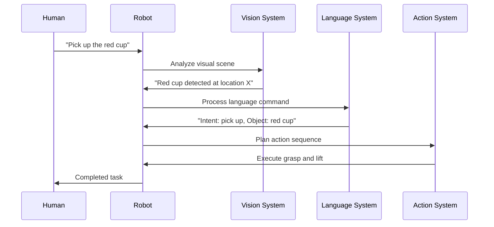

# Chapter 1: Introduction to Vision-Language-Action (VLA) in Robotics

## Overview

Vision-Language-Action (VLA) represents a paradigm shift in robotics, where visual perception, natural language understanding, and motor action are seamlessly integrated into a unified system. This convergence enables humanoid robots to understand and respond to complex human instructions in natural language while perceiving and interacting with their environment.

In this chapter, we'll explore the fundamental concepts of VLA systems, their components, and how they work together to create more intuitive and capable robots.

:::tip
VLA systems are revolutionizing human-robot interaction by enabling robots to understand natural language commands while perceiving their environment and executing appropriate actions. Think of it as giving robots the ability to see, understand, and act like humans do in everyday situations.
:::

## The VLA Framework

The Vision-Language-Action framework consists of three interconnected components that work in harmony:

1. **Vision**: The robot's ability to perceive and understand its environment through cameras, sensors, and computer vision algorithms
2. **Language**: The robot's ability to understand and generate natural language to communicate with humans
3. **Action**: The robot's ability to execute physical movements and tasks in response to visual and linguistic inputs

:::note
The key to effective VLA systems is not just having these three components, but integrating them in a way that they can share information and coordinate actions seamlessly. This integration is what enables robots to perform complex tasks that require both perception and understanding.
:::

### Visual Perception in VLA Systems

Visual perception forms the foundation of VLA systems. It involves:

- **Object Detection**: Identifying and locating objects in the environment
- **Scene Understanding**: Comprehending the spatial relationships between objects
- **Visual Tracking**: Following moving objects or people
- **Depth Estimation**: Understanding the 3D structure of the environment

Modern VLA systems leverage deep learning models like convolutional neural networks (CNNs) and vision transformers to achieve human-level visual understanding.

:::info
In practical implementations, visual perception systems often need to operate in real-time to enable responsive robot behavior. This requires efficient algorithms and sometimes specialized hardware accelerators.
:::

### Language Understanding in VLA Systems

Language understanding enables robots to interpret human instructions and respond appropriately. Key components include:

- **Natural Language Processing (NLP)**: Parsing and understanding human language
- **Intent Recognition**: Determining what the human wants the robot to do
- **Context Awareness**: Understanding the current situation and relevant information
- **Dialogue Management**: Maintaining coherent conversations over time

:::tip
When designing language understanding systems for robotics, it's important to consider that human commands are often ambiguous or underspecified. The system needs to be able to ask clarifying questions or make reasonable assumptions based on context.
:::

### Action Generation in VLA Systems

Action generation translates visual and linguistic inputs into physical robot behaviors:

- **Motion Planning**: Determining how to move the robot's body to accomplish tasks
- **Manipulation Planning**: Planning how to interact with objects
- **Control Execution**: Executing precise motor commands
- **Feedback Integration**: Adjusting actions based on sensory feedback

:::caution
Safety is paramount when generating actions for physical robots. All action planning must include safety checks to prevent harm to humans, the robot itself, or the environment.
:::

## VLA System Architecture

A typical VLA system architecture includes several key components:

:::note
Understanding the system architecture is crucial for implementing effective VLA systems. Each component plays a specific role, and the interfaces between components determine how well the system performs as a whole.
:::

### 1. Sensor Integration Layer

This layer handles input from various sensors:

```python
import cv2
import numpy as np

class SensorInterface:
    def __init__(self):
        self.camera = cv2.VideoCapture(0)  # RGB camera
        self.depth_camera = None  # Depth sensor
        self.microphone = None    # Audio input

    def capture_rgb_image(self):
        ret, frame = self.camera.read()
        if ret:
            return frame
        return None

    def capture_audio(self):
        # Implementation for audio capture
        pass
```

:::tip
When implementing sensor interfaces, consider the timing requirements of your application. Some sensors may need to be polled at specific rates, while others may provide asynchronous data streams.
:::

### 2. Perception Engine

The perception engine processes sensor data to extract meaningful information:

```python
class PerceptionEngine:
    def __init__(self):
        # Initialize computer vision models
        self.object_detector = self.load_object_detection_model()
        self.scene_segmenter = self.load_scene_segmentation_model()

    def process_visual_input(self, image):
        objects = self.object_detector.detect(image)
        scene = self.scene_segmenter.segment(image)
        return {
            'objects': objects,
            'scene': scene,
            'spatial_relations': self.extract_spatial_relations(objects)
        }
```

:::info
The perception engine is often the most computationally intensive component of a VLA system. Consider using GPU acceleration or specialized hardware to achieve real-time performance.
:::

### 3. Language Processing Module

This module handles natural language understanding:

```python
class LanguageProcessor:
    def __init__(self):
        # Initialize language models
        self.nlp_model = self.load_nlp_model()

    def process_command(self, command_text):
        intent = self.extract_intent(command_text)
        entities = self.extract_entities(command_text)
        return {
            'intent': intent,
            'entities': entities,
            'action_type': self.map_to_action(intent)
        }
```

### 4. Action Planning and Execution

This component translates high-level goals into executable actions:

```python
class ActionPlanner:
    def __init__(self):
        self.motion_planner = self.load_motion_planner()
        self.manipulation_planner = self.load_manipulation_planner()

    def plan_action(self, goal, environment_state):
        # Plan motion and manipulation sequences
        motion_plan = self.motion_planner.plan(goal, environment_state)
        manipulation_plan = self.manipulation_planner.plan(goal, environment_state)

        return {
            'motion_sequence': motion_plan,
            'manipulation_sequence': manipulation_plan
        }
```

:::caution
Always validate planned actions before execution. The planning process might generate actions that are physically impossible or unsafe for the current environment.
:::

## VLA System Diagrams

Let's visualize the VLA system architecture with diagrams to better understand how the components interact:

### VLA System Flow Diagram



### Component Interaction Diagram



### VLA Pipeline Visualization



## Real-World Applications

VLA systems have numerous applications in humanoid robotics:

:::tip
When implementing VLA systems for specific applications, consider the unique requirements and constraints of each domain. Different applications may emphasize different aspects of the VLA framework.
:::

### Domestic Assistance

- **Kitchen Tasks**: Following natural language instructions to prepare food, clean dishes, or organize items
- **Household Chores**: Understanding commands like "Clean the living room" or "Put the book on the shelf"
- **Elderly Care**: Assisting with daily activities based on verbal requests

### Industrial Automation

- **Collaborative Robotics**: Working alongside humans in manufacturing environments
- **Quality Inspection**: Understanding visual defects and reporting in natural language
- **Maintenance Tasks**: Following complex instructions for equipment maintenance

### Healthcare and Rehabilitation

- **Patient Assistance**: Helping patients with mobility and daily activities
- **Therapy Support**: Following therapist instructions to assist with rehabilitation exercises
- **Medical Equipment Handling**: Understanding and executing precise medical tasks

## Challenges in VLA Systems

Implementing effective VLA systems presents several challenges:

:::warning
Addressing these challenges requires a multidisciplinary approach combining expertise in computer vision, natural language processing, robotics, and human-computer interaction.
:::

### 1. Multimodal Integration

Combining visual, linguistic, and action information requires sophisticated fusion techniques that can handle different data types and temporal dynamics.

### 2. Real-Time Processing

VLA systems must process multiple streams of information in real-time to enable responsive robot behavior.

### 3. Context Understanding

Robots must maintain context across multiple interactions and adapt to changing environments.

### 4. Safety and Reliability

Ensuring that VLA systems operate safely, especially in human-populated environments.

## Interactive Exercise: VLA Component Identification

Now let's test your understanding of VLA system components with an interactive exercise:

import VLAExercise from '@site/src/components/VLAExercise';

<VLAExercise />

## Hands-On Exercise: Setting Up Your First VLA Environment

In this exercise, you'll set up a basic VLA environment using ROS 2 and Python. This will serve as the foundation for more complex VLA implementations.

:::caution
Always ensure that your robot is in a safe environment before executing any physical actions. Test all code thoroughly in simulation before running on real hardware.
:::

### Prerequisites

- ROS 2 Humble Hawksbill installed
- Python 3.8+ with pip
- Basic understanding of ROS 2 concepts (nodes, topics, services)

### Step 1: Create the VLA Package

```bash
cd ~/ros2_ws/src
ros2 pkg create --build-type ament_python vla_robot_interface
cd vla_robot_interface
```

### Step 2: Create the VLA Node Structure

```python
# vla_robot_interface/vla_robot_interface/vla_node.py

import rclpy
from rclpy.node import Node
from sensor_msgs.msg import Image, CompressedImage
from std_msgs.msg import String
from geometry_msgs.msg import Twist
import cv2
from cv2 import cv2 as cv
import numpy as np

class VLARobotNode(Node):
    def __init__(self):
        super().__init__('vla_robot_node')

        # Publishers and subscribers
        self.image_sub = self.create_subscription(
            Image,
            '/camera/image_raw',
            self.image_callback,
            10
        )

        self.command_sub = self.create_subscription(
            String,
            '/vla/command',
            self.command_callback,
            10
        )

        self.cmd_vel_pub = self.create_publisher(
            Twist,
            '/cmd_vel',
            10
        )

        self.get_logger().info('VLA Robot Node initialized')

    def image_callback(self, msg):
        # Process incoming image data
        self.get_logger().info(f'Received image with shape: {msg.height}x{msg.width}')

    def command_callback(self, msg):
        # Process natural language command
        command = msg.data
        self.get_logger().info(f'Received command: {command}')

        # Simple command processing
        if 'forward' in command.lower():
            self.move_forward()
        elif 'stop' in command.lower():
            self.stop_robot()

    def move_forward(self):
        msg = Twist()
        msg.linear.x = 0.5  # Move forward at 0.5 m/s
        self.cmd_vel_pub.publish(msg)
        self.get_logger().info('Moving forward')

    def stop_robot(self):
        msg = Twist()
        msg.linear.x = 0.0
        msg.angular.z = 0.0
        self.cmd_vel_pub.publish(msg)
        self.get_logger().info('Robot stopped')

def main(args=None):
    rclpy.init(args=args)
    vla_node = VLARobotNode()

    try:
        rclpy.spin(vla_node)
    except KeyboardInterrupt:
        pass
    finally:
        vla_node.destroy_node()
        rclpy.shutdown()

if __name__ == '__main__':
    main()
```

### Step 3: Run the VLA Node

```bash
cd ~/ros2_ws
colcon build --packages-select vla_robot_interface
source install/setup.bash
ros2 run vla_robot_interface vla_node
```

### Step 4: Test with Commands

In another terminal:

```bash
# Send a command to the robot
ros2 topic pub /vla/command std_msgs/String "data: 'Move forward'"
```

## Summary

Vision-Language-Action systems represent the future of human-robot interaction, enabling more intuitive and natural communication between humans and robots. By integrating visual perception, language understanding, and action execution, VLA systems can respond to complex human instructions in dynamic environments.

:::tip
As you continue learning about VLA systems, focus on understanding how the three components work together rather than studying them in isolation. The integration is where the real power of VLA systems emerges.
:::

In the next chapter, we'll dive deeper into implementing voice-to-action systems using OpenAI Whisper, building on the foundational concepts introduced here.