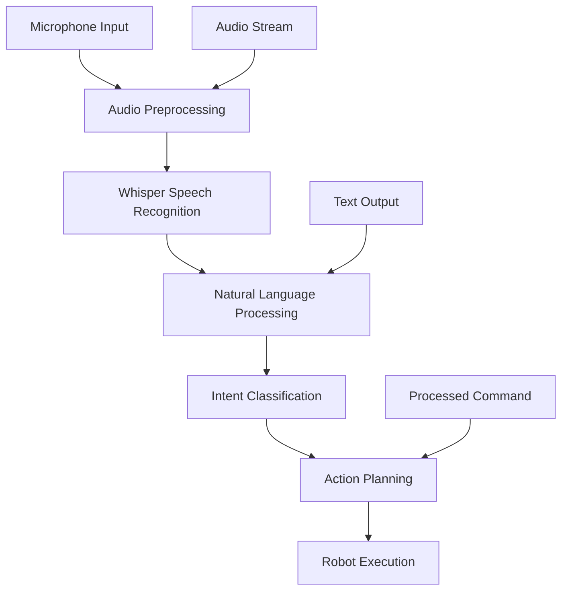

# Chapter 2: Voice-to-Action: Integrating OpenAI Whisper

## Overview

In the previous chapter, we explored the foundational concepts of Vision-Language-Action (VLA) systems. Now, we'll dive deeper into one of the most exciting aspects of VLA systems: voice-to-action integration. This chapter focuses on how humanoid robots can process spoken language and convert it into meaningful actions, with a particular emphasis on using OpenAI Whisper for speech recognition.

Voice-to-action systems enable robots to understand and respond to verbal commands in natural language, making human-robot interaction more intuitive and accessible. By integrating OpenAI Whisper, we can achieve state-of-the-art speech recognition capabilities that work in various acoustic environments.

In this chapter, we'll cover:
- The fundamentals of speech recognition and voice processing
- Integrating OpenAI Whisper into our VLA system
- Processing voice commands for robot action execution
- Handling voice command validation and error correction

:::tip
Voice-to-action systems significantly enhance the naturalness of human-robot interaction. Unlike text-based commands, voice commands allow for more spontaneous and fluid communication with robots.
:::

## Speech Recognition Fundamentals

Speech recognition is the process of converting spoken language into text that can be processed by computers. In the context of robotics, this is a critical component that enables robots to understand verbal commands from humans.

### Key Components of Speech Recognition

1. **Audio Input**: Capturing sound waves through microphones
2. **Preprocessing**: Filtering and enhancing the audio signal
3. **Feature Extraction**: Converting audio into a format suitable for processing
4. **Acoustic Model**: Mapping audio features to phonemes
5. **Language Model**: Converting phonemes to words and sentences
6. **Post-processing**: Refining the recognized text

:::note
The quality of speech recognition heavily depends on the acoustic environment. Background noise, reverberation, and microphone quality all impact recognition accuracy.
:::

### Challenges in Robotic Speech Recognition

When implementing speech recognition for robots, several unique challenges arise:

- **Noisy Environments**: Robots often operate in environments with mechanical noise, crowd noise, or other interfering sounds
- **Real-time Processing**: Robots need to respond promptly to voice commands
- **Speaker Independence**: Systems should work with various speakers regardless of accent, age, or voice characteristics
- **Command Recognition**: Focusing on specific robot commands rather than general conversation

## OpenAI Whisper Integration

OpenAI Whisper is a state-of-the-art speech recognition model that can transcribe speech in multiple languages. It's particularly well-suited for robotic applications due to its robustness and accuracy across various acoustic conditions.

### Why Whisper for Robotics?

OpenAI Whisper offers several advantages for voice-to-action systems:

- **Multilingual Support**: Supports transcription in 99+ languages
- **Robustness**: Performs well in noisy environments
- **Open Source**: Available under MIT license for research and commercial use
- **Real-time Capabilities**: Can process audio streams efficiently
- **Customization**: Can be fine-tuned for specific domains or commands

:::info
Whisper is particularly effective for robotic applications because it maintains accuracy even with background noise, which is common in real-world robotic environments.
:::

### Whisper Integration Architecture



### Backend Implementation

Let's implement the Whisper integration in our backend system:

```python
import asyncio
import base64
import io
from typing import Dict, List, Optional
import numpy as np
from fastapi import APIRouter, HTTPException, UploadFile, File
from pydantic import BaseModel
from ..database.database import get_db
from ..models.content import Content as ContentModel
from openai import AsyncOpenAI
import os
from dotenv import load_dotenv
from ..utils.logging_config import get_logger

# Load environment variables
load_dotenv()

logger = get_logger(__name__)

router = APIRouter()

# Initialize OpenAI client for Whisper
openai_client = AsyncOpenAI(api_key=os.getenv("OPENAI_API_KEY"))

class VoiceCommandRequest(BaseModel):
    audio_data: str  # Base64 encoded audio data
    audio_format: str = "wav"  # Format of the audio data
    language: Optional[str] = "en"  # Language code (e.g., 'en', 'es', 'fr')

class VoiceCommandResponse(BaseModel):
    success: bool
    transcription: str
    intent: str
    confidence: float
    action_commands: List[str]

class VoiceProcessingService:
    def __init__(self):
        self.client = openai_client

    async def transcribe_audio(self, audio_data: bytes, language: str = "en") -> str:
        """
        Transcribe audio using OpenAI Whisper
        """
        try:
            # Create a BytesIO object from the audio data
            audio_file = io.BytesIO(audio_data)
            audio_file.name = f"audio.{language}.wav"  # Temporary name for the file

            # Call Whisper API
            transcription = await self.client.audio.transcriptions.create(
                model="whisper-1",
                file=audio_file,
                language=language,
                response_format="text"
            )

            return transcription
        except Exception as e:
            logger.error(f"Error in Whisper transcription: {e}")
            raise HTTPException(status_code=500, detail=f"Transcription failed: {str(e)}")

    def extract_intent(self, text: str) -> Dict[str, any]:
        """
        Extract intent and relevant information from transcribed text
        """
        # This is a simplified intent extraction
        # In a real implementation, you would use more sophisticated NLP
        text_lower = text.lower()

        intents = {
            "move": ["move", "go", "walk", "step", "forward", "backward", "left", "right"],
            "grasp": ["grasp", "grab", "pick", "take", "lift", "hold"],
            "place": ["place", "put", "set", "down", "release"],
            "stop": ["stop", "halt", "pause", "wait"],
            "find": ["find", "locate", "search", "look for"],
            "follow": ["follow", "track", "chase", "accompany"]
        }

        detected_intent = "unknown"
        confidence = 0.0

        for intent, keywords in intents.items():
            for keyword in keywords:
                if keyword in text_lower:
                    detected_intent = intent
                    confidence = 0.8  # Base confidence
                    break
            if detected_intent != "unknown":
                break

        return {
            "intent": detected_intent,
            "confidence": confidence,
            "raw_text": text
        }

    def generate_action_commands(self, intent_data: Dict) -> List[str]:
        """
        Generate specific action commands based on detected intent
        """
        intent = intent_data["intent"]

        action_mapping = {
            "move": ["navigate_to_target", "adjust_position", "change_location"],
            "grasp": ["approach_object", "activate_gripper", "secure_object"],
            "place": ["navigate_to_destination", "release_object", "position_item"],
            "stop": ["halt_motors", "freeze_position", "cease_movement"],
            "find": ["scan_environment", "identify_target", "focus_on_object"],
            "follow": ["track_target", "maintain_distance", "adjust_path"]
        }

        return action_mapping.get(intent, ["standby"])

voice_service = VoiceProcessingService()

@router.post("/voice-command", response_model=VoiceCommandResponse)
async def process_voice_command(request: VoiceCommandRequest):
    """
    Process a voice command through Whisper and return actionable commands
    """
    try:
        # Decode the base64 audio data
        audio_bytes = base64.b64decode(request.audio_data)

        # Transcribe the audio using Whisper
        transcription = await voice_service.transcribe_audio(
            audio_bytes,
            language=request.language
        )

        # Extract intent from the transcription
        intent_data = voice_service.extract_intent(transcription)

        # Generate action commands based on the intent
        action_commands = voice_service.generate_action_commands(intent_data)

        response = VoiceCommandResponse(
            success=True,
            transcription=transcription,
            intent=intent_data["intent"],
            confidence=intent_data["confidence"],
            action_commands=action_commands
        )

        logger.info(f"Voice command processed: {transcription} -> {intent_data['intent']}")
        return response

    except Exception as e:
        logger.error(f"Error processing voice command: {e}")
        raise HTTPException(status_code=500, detail=f"Voice command processing failed: {str(e)}")

@router.post("/voice-upload", response_model=VoiceCommandResponse)
async def process_voice_upload(audio_file: UploadFile = File(...), language: str = "en"):
    """
    Process an uploaded audio file through Whisper
    """
    try:
        # Read the uploaded file
        audio_bytes = await audio_file.read()

        # Transcribe the audio using Whisper
        transcription = await voice_service.transcribe_audio(audio_bytes, language=language)

        # Extract intent from the transcription
        intent_data = voice_service.extract_intent(transcription)

        # Generate action commands based on the intent
        action_commands = voice_service.generate_action_commands(intent_data)

        response = VoiceCommandResponse(
            success=True,
            transcription=transcription,
            intent=intent_data["intent"],
            confidence=intent_data["confidence"],
            action_commands=action_commands
        )

        logger.info(f"Uploaded voice processed: {transcription} -> {intent_data['intent']}")
        return response

    except Exception as e:
        logger.error(f"Error processing uploaded voice: {e}")
        raise HTTPException(status_code=500, detail=f"Voice upload processing failed: {str(e)}")
```

:::caution
When implementing voice-to-action systems, always consider privacy implications. Voice data is sensitive and should be handled according to applicable privacy regulations and user consent requirements.
:::

## Voice Command Processing Pipeline

The voice command processing pipeline consists of several stages that transform spoken language into robot actions:

### 1. Audio Capture and Preprocessing

The first step is capturing high-quality audio from the environment. This involves:

- **Microphone Array Setup**: Using multiple microphones for better sound capture and noise reduction
- **Audio Filtering**: Removing background noise and enhancing speech signals
- **Format Conversion**: Converting audio to the appropriate format for Whisper processing

### 2. Speech-to-Text Conversion

Using OpenAI Whisper to convert speech to text:

- **Real-time vs Batch Processing**: Choosing between real-time streaming and batch processing based on application needs
- **Language Detection**: Automatically detecting or specifying the language for better accuracy
- **Punctuation and Formatting**: Ensuring proper text formatting for downstream processing

### 3. Natural Language Understanding

Converting text commands into actionable intents:

- **Intent Classification**: Determining the robot's task from the command
- **Entity Extraction**: Identifying specific objects, locations, or parameters mentioned in the command
- **Context Integration**: Using environmental context to disambiguate commands

### 4. Action Planning and Execution

Translating intents into robot actions:

- **Action Sequence Generation**: Creating step-by-step action plans
- **Safety Validation**: Ensuring planned actions are safe before execution
- **Feedback Integration**: Monitoring execution and adjusting as needed

## Frontend Voice Integration

To make voice commands accessible to users, we need to implement frontend components that can capture audio and send it to our backend:

```jsx
import React, { useState, useRef } from 'react';

const VoiceCommandWidget = () => {
  const [isRecording, setIsRecording] = useState(false);
  const [transcription, setTranscription] = useState('');
  const [isProcessing, setIsProcessing] = useState(false);
  const [result, setResult] = useState(null);

  const mediaRecorderRef = useRef(null);
  const audioChunksRef = useRef([]);

  const startRecording = async () => {
    try {
      const stream = await navigator.mediaDevices.getUserMedia({ audio: true });
      mediaRecorderRef.current = new MediaRecorder(stream);
      audioChunksRef.current = [];

      mediaRecorderRef.current.ondataavailable = (event) => {
        audioChunksRef.current.push(event.data);
      };

      mediaRecorderRef.current.onstop = async () => {
        const audioBlob = new Blob(audioChunksRef.current, { type: 'audio/wav' });
        const base64Data = await blobToBase64(audioBlob);

        await sendVoiceCommand(base64Data);

        // Stop all tracks
        stream.getTracks().forEach(track => track.stop());
      };

      mediaRecorderRef.current.start();
      setIsRecording(true);
      setTranscription('');
      setResult(null);
    } catch (error) {
      console.error('Error accessing microphone:', error);
      alert('Could not access microphone. Please check permissions.');
    }
  };

  const stopRecording = () => {
    if (mediaRecorderRef.current && isRecording) {
      mediaRecorderRef.current.stop();
      setIsRecording(false);
    }
  };

  const blobToBase64 = (blob) => {
    return new Promise((resolve, reject) => {
      const reader = new FileReader();
      reader.onload = () => {
        // Remove the data URL prefix (e.g., "data:audio/wav;base64,")
        const base64 = reader.result.split(',')[1];
        resolve(base64);
      };
      reader.onerror = reject;
      reader.readAsDataURL(blob);
    });
  };

  const sendVoiceCommand = async (base64Audio) => {
    setIsProcessing(true);

    try {
      const response = await fetch('/api/chat/voice-command', {
        method: 'POST',
        headers: {
          'Content-Type': 'application/json',
        },
        body: JSON.stringify({
          audio_data: base64Audio,
          audio_format: 'wav',
          language: 'en'
        })
      });

      if (!response.ok) {
        throw new Error(`API request failed with status ${response.status}`);
      }

      const data = await response.json();
      setResult(data);
      setTranscription(data.transcription);
    } catch (error) {
      console.error('Error sending voice command:', error);
      setResult({ success: false, error: 'Failed to process voice command' });
    } finally {
      setIsProcessing(false);
    }
  };

  return (
    <div className="voice-command-widget">
      <div className="voice-controls">
        <button
          className={`record-button ${isRecording ? 'recording' : ''}`}
          onMouseDown={startRecording}
          onMouseUp={stopRecording}
          onTouchStart={startRecording}
          onTouchEnd={stopRecording}
          disabled={isProcessing}
        >
          {isProcessing ? 'Processing...' : isRecording ? '● Recording...' : '🎤 Hold to Speak'}
        </button>
      </div>

      {transcription && (
        <div className="transcription-result">
          <h4>Transcription:</h4>
          <p>{transcription}</p>
        </div>
      )}

      {result && result.success && (
        <div className="action-result">
          <h4>Detected Intent: {result.intent} (Confidence: {(result.confidence * 100).toFixed(1)}%)</h4>
          <h5>Action Commands:</h5>
          <ul>
            {result.action_commands.map((cmd, index) => (
              <li key={index}>{cmd}</li>
            ))}
          </ul>
        </div>
      )}

      {result && !result.success && (
        <div className="error-result">
          <p>Error: {result.error || 'Voice command processing failed'}</p>
        </div>
      )}
    </div>
  );
};

export default VoiceCommandWidget;
```

:::tip
For better user experience, consider providing visual feedback during recording (like a waveform visualization) and confirmation of the transcribed command before executing robot actions.
:::

## Voice Command Validation and Error Handling

Robust voice-to-action systems must include validation and error handling:

### Command Validation

- **Syntax Checking**: Ensuring commands follow expected patterns
- **Semantic Validation**: Verifying commands make sense in the current context
- **Safety Checks**: Preventing commands that could cause harm

### Error Handling Strategies

- **Recognition Errors**: Handling cases where Whisper fails to transcribe clearly
- **Ambiguity Resolution**: Asking for clarification when commands are unclear
- **Fallback Mechanisms**: Providing alternative interaction methods when voice fails

## Hands-On Exercise: Implementing Voice-to-Action

Let's implement a complete voice-to-action system by extending our existing VLA framework:

### Step 1: Update the ROS 2 Node

```python
# vla_robot_interface/vla_robot_interface/voice_to_action_node.py

import rclpy
from rclpy.node import Node
from sensor_msgs.msg import Image, CompressedImage
from std_msgs.msg import String
from geometry_msgs.msg import Twist
from audio_common_msgs.msg import AudioData
import speech_recognition as sr
import requests
import json

class VoiceToActionNode(Node):
    def __init__(self):
        super().__init__('voice_to_action_node')

        # Publishers and subscribers
        self.voice_sub = self.create_subscription(
            AudioData,
            '/audio',
            self.voice_callback,
            10
        )

        self.command_pub = self.create_publisher(
            String,
            '/vla/command',
            10
        )

        self.cmd_vel_pub = self.create_publisher(
            Twist,
            '/cmd_vel',
            10
        )

        # Initialize speech recognizer
        self.recognizer = sr.Recognizer()
        self.microphone = sr.Microphone()

        self.get_logger().info('Voice-to-Action Node initialized')

    def voice_callback(self, msg):
        """Process incoming audio data"""
        try:
            # Convert audio data to audio segment
            audio_data = sr.AudioData(msg.data, msg.sample_rate, msg.sample_width)

            # Recognize speech using Google Speech Recognition
            command_text = self.recognizer.recognize_google(audio_data)
            self.get_logger().info(f'Recognized command: {command_text}')

            # Process the command
            self.process_voice_command(command_text)

        except sr.UnknownValueError:
            self.get_logger().info('Speech recognition could not understand audio')
        except sr.RequestError as e:
            self.get_logger().info(f'Speech recognition error: {e}')

    def process_voice_command(self, command_text):
        """Process the recognized voice command"""
        # Send to our backend for processing
        backend_url = "http://localhost:8000/api/chat/voice-command"

        payload = {
            "transcription": command_text,
            "language": "en"
        }

        try:
            response = requests.post(backend_url, json=payload)
            if response.status_code == 200:
                result = response.json()
                if result["success"]:
                    # Execute the action commands
                    for action_cmd in result["action_commands"]:
                        self.execute_action(action_cmd)
        except Exception as e:
            self.get_logger().error(f'Backend communication error: {e}')

    def execute_action(self, action_cmd):
        """Execute a specific action command"""
        if "move" in action_cmd or "forward" in action_cmd:
            self.move_forward()
        elif "stop" in action_cmd:
            self.stop_robot()

    def move_forward(self):
        msg = Twist()
        msg.linear.x = 0.3  # Move forward at 0.3 m/s
        self.cmd_vel_pub.publish(msg)
        self.get_logger().info('Moving forward based on voice command')

    def stop_robot(self):
        msg = Twist()
        msg.linear.x = 0.0
        msg.angular.z = 0.0
        self.cmd_vel_pub.publish(msg)
        self.get_logger().info('Robot stopped based on voice command')

def main(args=None):
    rclpy.init(args=args)
    voice_node = VoiceToActionNode()

    try:
        rclpy.spin(voice_node)
    except KeyboardInterrupt:
        pass
    finally:
        voice_node.destroy_node()
        rclpy.shutdown()

if __name__ == '__main__':
    main()
```

### Step 2: Testing Voice Commands

Test your voice-to-action system with various commands:

1. **Simple Movement**: "Move forward", "Go straight", "Stop"
2. **Object Interaction**: "Pick up the red cup", "Place the object on the table"
3. **Navigation**: "Go to the kitchen", "Turn left", "Approach the door"

:::warning
Always test voice-to-action systems in safe environments. Ensure the robot has emergency stop capabilities and operates within safe parameters during testing.
:::

## Summary

Voice-to-action systems represent a significant advancement in human-robot interaction, enabling more natural and intuitive communication. By integrating OpenAI Whisper with our VLA framework, we can create robots that understand and respond to spoken commands with high accuracy.

Key takeaways from this chapter:
- OpenAI Whisper provides robust speech recognition capabilities for robotic applications
- The voice processing pipeline involves audio capture, transcription, intent extraction, and action planning
- Proper error handling and validation are crucial for safe operation
- Frontend integration enables users to interact with the voice system

In the next chapter, we'll explore cognitive planning with LLMs, where we'll teach robots to decompose complex natural language commands into sequences of actions using large language models.

:::tip
As you implement voice-to-action systems, focus on creating a seamless user experience. The goal is to make robot interaction as natural as talking to another person.
:::