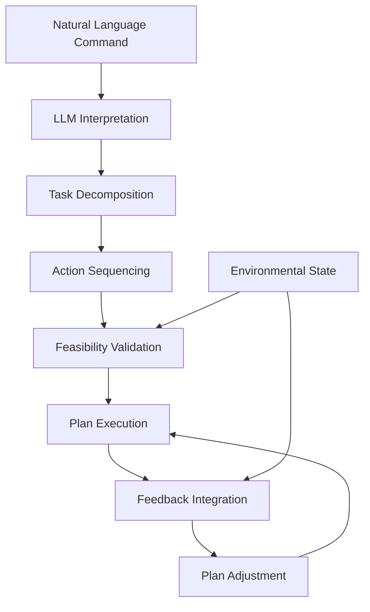

# Chapter 3: Cognitive Planning with LLMs and Capstone Project

## Overview

In the previous chapters, we explored voice-to-action systems using OpenAI Whisper. Now, we'll dive deeper into cognitive planning, where Large Language Models (LLMs) play a crucial role in decomposing complex natural language commands into executable robot action sequences.

Cognitive planning represents the highest level of VLA (Vision-Language-Action) integration, where robots don't just execute simple commands but understand complex, multi-step tasks and plan their execution. This chapter will show you how to leverage LLMs for natural language processing and cognitive planning in robotic systems.

In this chapter, we'll cover:
- Cognitive planning fundamentals in robotics
- Integrating LLMs for natural language processing
- Decomposing complex commands into action sequences
- Implementing cognitive planning validation and error correction
- Building the capstone project

:::tip
Cognitive planning bridges the gap between high-level human instructions and low-level robot actions. It's the brain that turns "Clean the kitchen" into a sequence of specific actions like "Go to kitchen", "Identify dirty surfaces", "Grab cleaning cloth", etc.
:::

## Cognitive Planning Fundamentals

Cognitive planning in robotics refers to the process of converting high-level goals or natural language commands into detailed, executable action sequences. This involves:

1. **Understanding**: Interpreting the user's intent from natural language
2. **Decomposition**: Breaking down complex tasks into simpler subtasks
3. **Sequencing**: Ordering subtasks in a logical execution sequence
4. **Validation**: Ensuring the plan is feasible and safe
5. **Adaptation**: Adjusting the plan based on environmental feedback

### The Planning Pipeline



### Hierarchical Task Decomposition

Complex tasks are typically decomposed into hierarchical structures:

```
"Set the dinner table"
├── "Go to dining room"
├── "Identify table location"
├── "Fetch plates"
│   ├── "Locate plate storage"
│   ├── "Navigate to storage"
│   ├── "Grasp plates"
│   └── "Return to table"
├── "Fetch utensils"
│   ├── "Locate utensil storage"
│   ├── "Navigate to storage"
│   ├── "Grasp utensils"
│   └── "Return to table"
└── "Arrange items on table"
    ├── "Position plates"
    ├── "Position utensils"
    └── "Verify arrangement"
```

:::note
Effective cognitive planning requires understanding both the task structure and the environmental constraints. The same command may require different action sequences depending on the current state of the environment.
:::

## LLM Integration for Natural Language Processing

Large Language Models excel at understanding the nuances of natural language, making them ideal for cognitive planning in robotics. Let's explore how to integrate LLMs into our system.

### LLM Selection and Configuration

For cognitive planning, we need LLMs that can:
- Understand complex natural language commands
- Generate structured outputs for robot actions
- Handle ambiguity and ask clarifying questions
- Reason about physical constraints and affordances

```python
import openai
from typing import Dict, List, Optional
from pydantic import BaseModel
import json

class LLMPlanner:
    def __init__(self, api_key: str, model: str = "gpt-4-turbo"):
        self.client = openai.AsyncOpenAI(api_key=api_key)
        self.model = model

    async def plan_from_command(
        self,
        command: str,
        environment_state: Dict = None,
        robot_capabilities: List[str] = None
    ) -> Dict:
        """
        Generate a cognitive plan from a natural language command
        """
        system_prompt = """
        You are a cognitive planning assistant for a humanoid robot. Your role is to:
        1. Understand the user's command in natural language
        2. Decompose the command into specific, executable robot actions
        3. Consider the robot's capabilities and environmental constraints
        4. Generate a step-by-step action sequence

        Respond in JSON format with the following structure:
        {
          "task_decomposition": [
            {
              "subtask": "description of subtask",
              "actions": ["action1", "action2", ...],
              "estimated_time": "time estimate",
              "potential_obstacles": ["obstacle1", "obstacle2", ...]
            }
          ],
          "execution_order": ["subtask1", "subtask2", ...],
          "safety_considerations": ["consideration1", "consideration2", ...],
          "uncertainty_assessment": "low/medium/high",
          "requires_clarification": false
        }
        """

        user_prompt = f"""
        Command: "{command}"

        Current environment state: {json.dumps(environment_state or {}, indent=2)}

        Robot capabilities: {', '.join(robot_capabilities or [])}

        Generate a detailed cognitive plan for the robot.
        """

        response = await self.client.chat.completions.create(
            model=self.model,
            messages=[
                {"role": "system", "content": system_prompt},
                {"role": "user", "content": user_prompt}
            ],
            response_format={"type": "json_object"}
        )

        return json.loads(response.choices[0].message.content)
```

:::info
Using structured outputs (JSON) from LLMs makes it easier to parse and execute the generated plans programmatically. This is crucial for reliable robot operation.
:::

### Natural Language Processing Pipeline

The NLP pipeline for cognitive planning involves several steps:

```python
class CognitivePlanner:
    def __init__(self, llm_planner: LLMPlanner):
        self.llm_planner = llm_planner

    async def process_command(self, command: str, env_state: Dict) -> Dict:
        """
        Process a natural language command and generate an executable plan
        """
        # Step 1: Parse the command using LLM
        plan = await self.llm_planner.plan_from_command(
            command=command,
            environment_state=env_state,
            robot_capabilities=self.get_robot_capabilities()
        )

        # Step 2: Validate the plan against robot capabilities
        validated_plan = await self.validate_plan(plan)

        # Step 3: Optimize the plan for execution
        optimized_plan = self.optimize_plan(validated_plan)

        return optimized_plan

    def validate_plan(self, plan: Dict) -> Dict:
        """
        Validate the plan against robot capabilities and environmental constraints
        """
        robot_caps = self.get_robot_capabilities()
        env_constraints = self.get_environment_constraints()

        for task in plan.get("task_decomposition", []):
            for action in task.get("actions", []):
                if not self.is_action_feasible(action, robot_caps, env_constraints):
                    # Modify the plan to use alternative actions
                    task["actions"] = self.get_alternative_actions(action, robot_caps)

        return plan

    def optimize_plan(self, plan: Dict) -> Dict:
        """
        Optimize the plan for efficient execution
        """
        # Parallelize tasks that can be executed simultaneously
        plan = self.parallelize_tasks(plan)

        # Optimize navigation paths
        plan = self.optimize_navigation(plan)

        # Estimate execution time
        plan["estimated_execution_time"] = self.estimate_execution_time(plan)

        return plan
```

## Action Sequence Generation

Once the LLM has decomposed the task, we need to generate specific action sequences that the robot can execute.

### Action Primitives

Robots typically have a set of primitive actions that can be combined to perform complex tasks:

```python
class ActionPrimitives:
    """
    Define basic robot action primitives
    """
    NAVIGATION_ACTIONS = [
        "navigate_to_location",
        "move_forward",
        "turn_left",
        "turn_right",
        "approach_object"
    ]

    MANIPULATION_ACTIONS = [
        "grasp_object",
        "release_object",
        "push_object",
        "pull_object",
        "manipulate_object"
    ]

    PERCEPTION_ACTIONS = [
        "detect_objects",
        "recognize_objects",
        "measure_distance",
        "scan_environment"
    ]

    COMPOSITE_ACTIONS = [
        "pick_and_place",
        "fetch_and_carry",
        "assemble_parts"
    ]

class ActionSequenceGenerator:
    def __init__(self):
        self.primitives = ActionPrimitives()

    def generate_sequence_from_plan(self, plan: Dict) -> List[Dict]:
        """
        Generate executable action sequence from cognitive plan
        """
        sequence = []

        for subtask in plan.get("task_decomposition", []):
            for action in subtask.get("actions", []):
                # Convert high-level action to robot-specific commands
                robot_action = self.convert_to_robot_action(action)
                sequence.append(robot_action)

        return sequence

    def convert_to_robot_action(self, high_level_action: str) -> Dict:
        """
        Convert high-level action to specific robot command
        """
        # This is a simplified mapping - in practice, this would be more sophisticated
        action_mapping = {
            "navigate to kitchen": {
                "type": "navigation",
                "command": "navigate_to_location",
                "parameters": {"location": "kitchen", "speed": "normal"}
            },
            "find object": {
                "type": "perception",
                "command": "detect_objects",
                "parameters": {"object_type": "any", "search_radius": 2.0}
            },
            "grasp object": {
                "type": "manipulation",
                "command": "grasp_object",
                "parameters": {"object_id": "auto_detect", "grip_strength": "medium"}
            },
            "move object": {
                "type": "manipulation",
                "command": "manipulate_object",
                "parameters": {"operation": "move", "destination": "auto_calculate"}
            }
        }

        # Return mapped action or a default if not found
        return action_mapping.get(high_level_action.lower(), {
            "type": "unknown",
            "command": "standby",
            "parameters": {},
            "original": high_level_action
        })
```

### Plan Execution Framework

```python
import asyncio
from enum import Enum
from dataclasses import dataclass
from typing import List, Dict, Any, Optional

class ExecutionStatus(Enum):
    PENDING = "pending"
    RUNNING = "running"
    SUCCESS = "success"
    FAILED = "failed"
    INTERRUPTED = "interrupted"

@dataclass
class ActionResult:
    status: ExecutionStatus
    result: Any = None
    error: str = None
    execution_time: float = 0.0

class PlanExecutor:
    def __init__(self, robot_interface):
        self.robot_interface = robot_interface
        self.current_plan = None
        self.execution_log = []

    async def execute_plan(self, plan_sequence: List[Dict]) -> Dict:
        """
        Execute a sequence of actions as part of a cognitive plan
        """
        results = []
        start_time = asyncio.get_event_loop().time()

        for i, action in enumerate(plan_sequence):
            try:
                # Execute the action
                result = await self.execute_action(action)

                # Log the result
                self.execution_log.append({
                    "step": i,
                    "action": action,
                    "result": result,
                    "timestamp": asyncio.get_event_loop().time()
                })

                results.append(result)

                # Check if plan should continue
                if result.status == ExecutionStatus.FAILED:
                    return {
                        "status": "partial_success",
                        "results": results,
                        "error_step": i,
                        "total_time": asyncio.get_event_loop().time() - start_time
                    }

            except Exception as e:
                error_result = ActionResult(
                    status=ExecutionStatus.FAILED,
                    error=str(e),
                    execution_time=0.0
                )
                results.append(error_result)
                break

        return {
            "status": "success",
            "results": results,
            "total_time": asyncio.get_event_loop().time() - start_time
        }

    async def execute_action(self, action: Dict) -> ActionResult:
        """
        Execute a single robot action
        """
        start_time = asyncio.get_event_loop().time()

        try:
            if action["type"] == "navigation":
                result = await self.robot_interface.navigate_to_location(
                    action["parameters"]["location"],
                    speed=action["parameters"].get("speed", "normal")
                )
            elif action["type"] == "manipulation":
                result = await self.robot_interface.execute_manipulation(
                    action["command"],
                    **action["parameters"]
                )
            elif action["type"] == "perception":
                result = await self.robot_interface.execute_perception(
                    action["command"],
                    **action["parameters"]
                )
            else:
                # Unknown action type
                return ActionResult(
                    status=ExecutionStatus.FAILED,
                    error=f"Unknown action type: {action['type']}",
                    execution_time=0.0
                )

            execution_time = asyncio.get_event_loop().time() - start_time

            return ActionResult(
                status=ExecutionStatus.SUCCESS,
                result=result,
                execution_time=execution_time
            )

        except Exception as e:
            execution_time = asyncio.get_event_loop().time() - start_time

            return ActionResult(
                status=ExecutionStatus.FAILED,
                error=str(e),
                execution_time=execution_time
            )
```

:::caution
Always validate action sequences before execution. The LLM might generate plans that are physically impossible or unsafe for the current environment.
:::

## Cognitive Planning Validation and Error Correction

Robust cognitive planning systems must include validation and error correction mechanisms.

### Plan Validation

```python
class PlanValidator:
    def __init__(self, robot_specs: Dict, environment_map: Dict):
        self.robot_specs = robot_specs
        self.environment_map = environment_map

    def validate_plan(self, plan: Dict) -> Dict:
        """
        Validate a cognitive plan for feasibility and safety
        """
        validation_results = {
            "is_valid": True,
            "issues": [],
            "warnings": [],
            "suggestions": []
        }

        # Check 1: Robot capability constraints
        capability_issues = self.check_capability_constraints(plan)
        validation_results["issues"].extend(capability_issues)

        # Check 2: Environmental constraints
        env_issues = self.check_environmental_constraints(plan)
        validation_results["issues"].extend(env_issues)

        # Check 3: Physical feasibility
        physics_issues = self.check_physical_feasibility(plan)
        validation_results["issues"].extend(physics_issues)

        # Check 4: Safety considerations
        safety_warnings = self.check_safety_considerations(plan)
        validation_results["warnings"].extend(safety_warnings)

        # Generate suggestions for improvement
        validation_results["suggestions"] = self.generate_suggestions(plan)

        # Overall validity
        validation_results["is_valid"] = len(validation_results["issues"]) == 0

        return validation_results

    def check_capability_constraints(self, plan: Dict) -> List[str]:
        """
        Check if the plan respects robot capability constraints
        """
        issues = []

        for task in plan.get("task_decomposition", []):
            for action in task.get("actions", []):
                if not self.robot_can_perform_action(action):
                    issues.append(f"Robot cannot perform action: {action}")

        return issues

    def check_environmental_constraints(self, plan: Dict) -> List[str]:
        """
        Check if the plan respects environmental constraints
        """
        issues = []

        # Check navigation routes for obstacles
        for task in plan.get("task_decomposition", []):
            if "navigate" in task.get("subtask", "").lower():
                route = self.get_navigation_route(task)
                if self.route_has_obstacles(route):
                    issues.append(f"Navigation route has obstacles: {route}")

        return issues

    def check_physical_feasibility(self, plan: Dict) -> List[str]:
        """
        Check if the plan is physically feasible
        """
        issues = []

        # Check weight limits for manipulation tasks
        for task in plan.get("task_decomposition", []):
            for action in task.get("actions", []):
                if "grasp" in action or "lift" in action:
                    if not self.object_within_weight_limit(action):
                        issues.append(f"Object exceeds weight limit: {action}")

        return issues

    def check_safety_considerations(self, plan: Dict) -> List[str]:
        """
        Check safety considerations in the plan
        """
        warnings = []

        # Check for potentially dangerous actions
        for task in plan.get("task_decomposition", []):
            for action in task.get("actions", []):
                if self.action_is_potentially_dangerous(action):
                    warnings.append(f"Potentially dangerous action: {action}")

        return warnings
```

### Error Recovery and Adaptation

```python
class ErrorRecoverySystem:
    def __init__(self, plan_validator: PlanValidator):
        self.validator = plan_validator
        self.recovery_strategies = self.initialize_recovery_strategies()

    async def handle_execution_error(self, error: Exception, current_plan: Dict, step_idx: int) -> Dict:
        """
        Handle execution errors and suggest recovery strategies
        """
        error_type = self.classify_error(error)
        recovery_strategy = self.select_recovery_strategy(error_type, current_plan, step_idx)

        if recovery_strategy["type"] == "retry":
            return await self.execute_retry(recovery_strategy, current_plan, step_idx)
        elif recovery_strategy["type"] == "alternative":
            return await self.execute_alternative(recovery_strategy, current_plan, step_idx)
        elif recovery_strategy["type"] == "skip":
            return await self.skip_and_continue(current_plan, step_idx)
        elif recovery_strategy["type"] == "abort":
            return {"status": "aborted", "error": str(error)}
        else:
            # Ask for human intervention
            return await self.request_human_intervention(error, current_plan, step_idx)

    def select_recovery_strategy(self, error_type: str, plan: Dict, step_idx: int) -> Dict:
        """
        Select appropriate recovery strategy based on error type and context
        """
        if error_type == "navigation_failure":
            return {
                "type": "alternative",
                "strategy": "find_alternative_path",
                "parameters": {"current_step": step_idx}
            }
        elif error_type == "manipulation_failure":
            return {
                "type": "alternative",
                "strategy": "try_different_approach",
                "parameters": {"object_properties": self.get_object_properties(plan, step_idx)}
            }
        elif error_type == "perception_failure":
            return {
                "type": "retry",
                "strategy": "reposition_and_retry",
                "parameters": {"attempts_remaining": 3}
            }
        else:
            return {
                "type": "abort",
                "strategy": "unknown_error",
                "parameters": {}
            }

    async def execute_retry(self, strategy: Dict, plan: Dict, step_idx: int) -> Dict:
        """
        Execute a retry strategy
        """
        max_attempts = strategy.get("parameters", {}).get("attempts_remaining", 3)
        current_attempt = 0

        while current_attempt < max_attempts:
            try:
                # Retry the failed action
                result = await self.execute_plan_step(plan, step_idx)
                if result["status"] == "success":
                    return result
            except Exception as e:
                current_attempt += 1
                if current_attempt >= max_attempts:
                    return {"status": "failed_after_retries", "error": str(e)}

        return {"status": "failed", "error": "Max retries exceeded"}
```

## Capstone Project: Autonomous Kitchen Assistant

Now let's put everything together in a capstone project that demonstrates cognitive planning with LLMs in a practical scenario.

### Project Overview

Our capstone project will be an autonomous kitchen assistant that can:
- Understand complex natural language commands
- Plan multi-step tasks like meal preparation
- Execute actions safely in a kitchen environment
- Handle unexpected situations and errors

### Implementation

```python
class KitchenAssistant:
    def __init__(self, llm_planner: LLMPlanner, plan_executor: PlanExecutor):
        self.planner = CognitivePlanner(llm_planner)
        self.executor = plan_executor
        self.environment_monitor = EnvironmentMonitor()
        self.error_recovery = ErrorRecoverySystem(PlanValidator(
            robot_specs=self.get_robot_specs(),
            environment_map=self.get_kitchen_map()
        ))

    async def process_kitchen_command(self, command: str) -> Dict:
        """
        Process a kitchen-related command and execute it
        """
        # Get current environment state
        env_state = await self.environment_monitor.get_current_state()

        # Generate cognitive plan
        plan = await self.planner.process_command(command, env_state)

        # Validate the plan
        validation = self.error_recovery.validator.validate_plan(plan)

        if not validation["is_valid"]:
            # Attempt to refine the plan based on validation issues
            refined_plan = await self.refine_plan(plan, validation["issues"])
            if refined_plan:
                plan = refined_plan
            else:
                return {
                    "status": "validation_failed",
                    "issues": validation["issues"],
                    "suggestions": validation["suggestions"]
                }

        # Execute the plan
        execution_result = await self.executor.execute_plan(
            self.generate_action_sequence(plan)
        )

        # Handle any execution errors
        if execution_result["status"] == "partial_success":
            error_step = execution_result["error_step"]
            error = execution_result["results"][error_step]["result"].error

            recovery_result = await self.error_recovery.handle_execution_error(
                error, plan, error_step
            )

            if recovery_result["status"] == "success":
                # Resume execution from the point of failure
                remaining_steps = self.get_remaining_steps(plan, error_step + 1)
                resume_result = await self.executor.execute_plan(remaining_steps)
                return {**execution_result, **resume_result}
            else:
                return recovery_result

        return execution_result

    def generate_action_sequence(self, plan: Dict) -> List[Dict]:
        """
        Generate robot-specific action sequence from cognitive plan
        """
        generator = ActionSequenceGenerator()
        return generator.generate_sequence_from_plan(plan)

    async def refine_plan(self, original_plan: Dict, issues: List[str]) -> Optional[Dict]:
        """
        Refine a plan based on identified issues
        """
        # For now, return None to indicate refinement is not possible
        # In a real implementation, this would use the LLM to generate a refined plan
        return None
```

:::tip
The key to successful cognitive planning is iterative refinement. Start with simple plans and gradually increase complexity as the system learns to handle more sophisticated tasks reliably.
:::

## Hands-On Exercise: Implementing Cognitive Planning

Let's implement a basic cognitive planning system by extending our existing VLA framework:

### Step 1: Update the Backend API

First, let's add cognitive planning endpoints to our RAG API:

```python
from pydantic import BaseModel
from typing import Dict, List, Optional

class CognitivePlanRequest(BaseModel):
    command: str
    environment_state: Optional[Dict] = {}
    robot_capabilities: Optional[List[str]] = []

class CognitivePlanResponse(BaseModel):
    success: bool
    command: str
    plan: Dict
    validation_results: Dict
    estimated_time: float
    requires_clarification: bool
    error_message: Optional[str] = None

@router.post("/cognitive-plan", response_model=CognitivePlanResponse)
async def generate_cognitive_plan(request: CognitivePlanRequest):
    """
    Generate a cognitive plan from natural language command using LLM
    """
    try:
        # Initialize the LLM planner
        llm_planner = LLMPlanner(api_key=os.getenv("OPENAI_API_KEY"))

        # Generate the cognitive plan
        plan = await llm_planner.plan_from_command(
            command=request.command,
            environment_state=request.environment_state,
            robot_capabilities=request.robot_capabilities
        )

        # Validate the plan
        validator = PlanValidator(
            robot_specs={},  # In a real implementation, get from robot
            environment_map={}  # In a real implementation, get from environment
        )
        validation_results = validator.validate_plan(plan)

        # Calculate estimated time
        estimated_time = len(plan.get("task_decomposition", [])) * 30  # 30 seconds per task avg

        return CognitivePlanResponse(
            success=True,
            command=request.command,
            plan=plan,
            validation_results=validation_results,
            estimated_time=estimated_time,
            requires_clarification=plan.get("requires_clarification", False)
        )

    except Exception as e:
        print(f"Error generating cognitive plan: {e}")
        return CognitivePlanResponse(
            success=False,
            command=request.command,
            plan={},
            validation_results={},
            estimated_time=0.0,
            requires_clarification=False,
            error_message=str(e)
        )
```

### Step 2: Test the Cognitive Planning System

Test your cognitive planning system with various commands:

1. **Simple Commands**: "Move forward", "Turn left"
2. **Complex Commands**: "Clean the kitchen counter", "Prepare a sandwich"
3. **Multi-step Commands**: "Go to the kitchen, find a glass, fill it with water, and bring it to the living room"

## Summary

Cognitive planning with LLMs represents the pinnacle of VLA integration, enabling robots to understand and execute complex, natural language commands. By leveraging the reasoning capabilities of large language models, we can create robots that decompose high-level goals into executable action sequences.

Key takeaways from this chapter:
- Cognitive planning bridges natural language understanding and robot action execution
- LLMs excel at task decomposition and reasoning about physical constraints
- Validation and error recovery are crucial for safe operation
- Iterative refinement improves planning reliability

In the next chapter, we'll integrate all components into a comprehensive capstone project that demonstrates the complete VLA system in action.

:::note
As you develop cognitive planning systems, always prioritize safety and validation. The LLM might generate creative but unsafe plans that need to be caught by your validation systems.
:::