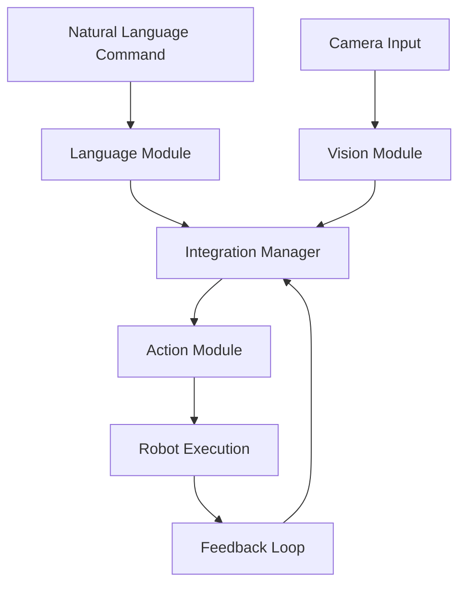

# Chapter 4: Capstone Autonomous Humanoid Project

## Overview

In this final chapter, we'll bring together all the concepts from this module to create a complete Vision-Language-Action (VLA) system for an autonomous humanoid robot. This capstone project integrates vision processing, language understanding, and action execution into a unified system that can respond to natural language commands in real-world environments.

The capstone project will demonstrate:
- Complete VLA system integration
- Real-time vision processing and object recognition
- Natural language command interpretation
- Safe and reliable action execution
- Human-robot interaction in practical scenarios

:::tip
The capstone project represents the culmination of all concepts learned in this module. Successfully implementing this system will give you a comprehensive understanding of VLA systems in humanoid robotics.
:::

## System Architecture

Our integrated VLA system consists of three main modules that work together to process natural language commands and execute corresponding actions:



### Core Components

1. **Vision Module**: Processes visual input and identifies objects, people, and environmental features
2. **Language Module**: Interprets natural language commands and extracts actionable intents
3. **Action Module**: Plans and executes robot movements and manipulations
4. **Integration Manager**: Coordinates between all modules and manages the execution flow

## Complete VLA System Implementation

Let's implement the complete integrated VLA system:

```python
# vla_system/vla_system/integrated_vla.py

import asyncio
import rclpy
from rclpy.node import Node
from sensor_msgs.msg import Image, CompressedImage
from geometry_msgs.msg import Twist
from std_msgs.msg import String
from cv_bridge import CvBridge
import cv2
import numpy as np
from typing import Dict, List, Optional, Tuple
import json
from dataclasses import dataclass
from enum import Enum

class ActionStatus(Enum):
    PENDING = "pending"
    EXECUTING = "executing"
    COMPLETED = "completed"
    FAILED = "failed"
    CANCELLED = "cancelled"

@dataclass
class VisionResult:
    objects: List[Dict]
    environment_map: Dict
    detected_persons: List[Dict]
    obstacles: List[Dict]

@dataclass
class LanguageIntent:
    action: str
    target_object: Optional[str]
    destination: Optional[str]
    parameters: Dict

@dataclass
class ActionPlan:
    steps: List[str]
    estimated_time: float
    safety_risk: float

class VisionModule(Node):
    def __init__(self):
        super().__init__('vision_module')
        self.bridge = CvBridge()

        # Subscribers
        self.image_sub = self.create_subscription(
            Image,
            '/camera/rgb/image_raw',
            self.image_callback,
            10
        )

        # Publishers
        self.vision_pub = self.create_publisher(
            String,
            '/vla/vision_result',
            10
        )

        # Vision processing parameters
        self.confidence_threshold = 0.7
        self.object_detection_model = self.load_object_detection_model()

        self.get_logger().info('Vision Module initialized')

    def load_object_detection_model(self):
        """Load pre-trained object detection model"""
        # In a real implementation, this would load a YOLO or similar model
        # For this example, we'll simulate detection
        return "mock_model"

    def image_callback(self, msg):
        """Process incoming camera images"""
        try:
            cv_image = self.bridge.imgmsg_to_cv2(msg, "bgr8")
            vision_result = self.process_image(cv_image)

            # Publish vision results
            result_msg = String()
            result_msg.data = json.dumps({
                'objects': vision_result.objects,
                'environment_map': vision_result.environment_map,
                'detected_persons': vision_result.detected_persons,
                'obstacles': vision_result.obstacles,
                'timestamp': self.get_clock().now().to_msg().sec
            })

            self.vision_pub.publish(result_msg)

        except Exception as e:
            self.get_logger().error(f'Error processing image: {e}')

    def process_image(self, cv_image) -> VisionResult:
        """Process image and extract relevant information"""
        # Simulate object detection (in real implementation, use actual detection model)
        height, width = cv_image.shape[:2]

        # Mock object detection results
        objects = [
            {
                'name': 'red_cup',
                'confidence': 0.85,
                'bbox': [int(width * 0.3), int(height * 0.4), int(width * 0.1), int(height * 0.1)],
                'position_3d': [0.5, 1.2, 0.0]  # x, y, z in robot coordinate frame
            },
            {
                'name': 'table',
                'confidence': 0.92,
                'bbox': [int(width * 0.1), int(height * 0.6), int(width * 0.8), int(height * 0.3)],
                'position_3d': [0.0, 1.0, 0.0]
            }
        ]

        # Mock environment mapping
        environment_map = {
            'kitchen': {'center': [2.0, 1.0], 'radius': 1.5},
            'living_room': {'center': [-1.0, 0.5], 'radius': 2.0},
            'hallway': {'center': [0.0, -1.0], 'radius': 0.5}
        }

        detected_persons = [
            {
                'id': 'person_1',
                'position_3d': [1.5, 0.8, 0.0],
                'orientation': 0.0
            }
        ]

        obstacles = [
            {
                'type': 'furniture',
                'position_3d': [1.0, 0.5, 0.0],
                'size': [0.8, 0.6, 0.8]
            }
        ]

        return VisionResult(
            objects=objects,
            environment_map=environment_map,
            detected_persons=detected_persons,
            obstacles=obstacles
        )

class LanguageModule(Node):
    def __init__(self):
        super().__init__('language_module')

        # Publishers and subscribers
        self.command_sub = self.create_subscription(
            String,
            '/vla/natural_command',
            self.command_callback,
            10
        )

        self.intent_pub = self.create_publisher(
            String,
            '/vla/language_intent',
            10
        )

        # Mock NLP model (in real implementation, integrate with LLM API)
        self.intent_classifier = self.load_intent_model()

        self.get_logger().info('Language Module initialized')

    def load_intent_model(self):
        """Load intent classification model"""
        # In a real implementation, this would load an NLP model or connect to an LLM
        return "mock_nlp_model"

    def command_callback(self, msg):
        """Process natural language commands"""
        try:
            command_text = msg.data
            intent = self.parse_command(command_text)

            # Publish intent
            intent_msg = String()
            intent_msg.data = json.dumps({
                'action': intent.action,
                'target_object': intent.target_object,
                'destination': intent.destination,
                'parameters': intent.parameters,
                'confidence': 0.85
            })

            self.intent_pub.publish(intent_msg)

        except Exception as e:
            self.get_logger().error(f'Error processing command: {e}')

    def parse_command(self, command: str) -> LanguageIntent:
        """Parse natural language command and extract intent"""
        command_lower = command.lower()

        # Simple rule-based intent extraction (in real implementation, use LLM)
        if any(word in command_lower for word in ['move', 'go', 'walk', 'navigate']):
            action = 'navigate'
            destination = self.extract_location(command_lower)
            target_object = self.extract_object(command_lower)
        elif any(word in command_lower for word in ['pick', 'grasp', 'take', 'grab']):
            action = 'grasp'
            target_object = self.extract_object(command_lower)
            destination = self.extract_location(command_lower)
        elif any(word in command_lower for word in ['place', 'put', 'set', 'drop']):
            action = 'place'
            target_object = self.extract_object(command_lower)
            destination = self.extract_location(command_lower)
        elif any(word in command_lower for word in ['stop', 'halt', 'pause']):
            action = 'stop'
            target_object = None
            destination = None
        else:
            action = 'unknown'
            target_object = None
            destination = None

        return LanguageIntent(
            action=action,
            target_object=target_object,
            destination=destination,
            parameters={}
        )

    def extract_location(self, command: str) -> Optional[str]:
        """Extract location from command"""
        locations = ['kitchen', 'living room', 'bedroom', 'hallway', 'dining room', 'bathroom']
        for location in locations:
            if location in command:
                return location
        return None

    def extract_object(self, command: str) -> Optional[str]:
        """Extract object from command"""
        # Simple object extraction (in real implementation, use more sophisticated NLP)
        words = command.split()
        objects = ['cup', 'bottle', 'book', 'phone', 'keys', 'ball', 'box', 'plate']

        for word in words:
            for obj in objects:
                if obj in word:
                    return word
        return None

class ActionModule(Node):
    def __init__(self):
        super().__init__('action_module')

        # Publishers and subscribers
        self.action_sub = self.create_subscription(
            String,
            '/vla/action_plan',
            self.action_callback,
            10
        )

        self.cmd_vel_pub = self.create_publisher(
            Twist,
            '/cmd_vel',
            10
        )

        # Action execution state
        self.current_action_status = ActionStatus.PENDING
        self.safety_validator = self.setup_safety_validator()

        self.get_logger().info('Action Module initialized')

    def setup_safety_validator(self):
        """Setup safety validation system"""
        # In real implementation, integrate with robot's safety systems
        return "mock_safety_validator"

    async def execute_action_plan(self, plan: ActionPlan) -> bool:
        """Execute the action plan safely"""
        try:
            self.current_action_status = ActionStatus.EXECUTING

            for step in plan.steps:
                if not await self.execute_step(step):
                    self.current_action_status = ActionStatus.FAILED
                    return False

            self.current_action_status = ActionStatus.COMPLETED
            return True

        except Exception as e:
            self.get_logger().error(f'Error executing action plan: {e}')
            self.current_action_status = ActionStatus.FAILED
            return False

    async def execute_step(self, step: str) -> bool:
        """Execute a single action step"""
        try:
            if step.startswith('navigate_to'):
                # Extract coordinates from step
                coords = self.parse_coordinates(step)
                return await self.navigate_to(coords)
            elif step.startswith('grasp_object'):
                return await self.grasp_object()
            elif step.startswith('place_object'):
                return await self.place_object()
            elif step.startswith('stop_robot'):
                return await self.stop_robot()
            else:
                self.get_logger().warn(f'Unknown action step: {step}')
                return False

        except Exception as e:
            self.get_logger().error(f'Error executing step {step}: {e}')
            return False

    async def navigate_to(self, coordinates: Tuple[float, float, float]) -> bool:
        """Navigate to specified coordinates"""
        try:
            # Create twist message for navigation
            twist = Twist()
            # Calculate navigation commands based on coordinates
            # (simplified for example)
            twist.linear.x = 0.3  # Move forward
            twist.angular.z = 0.0  # No rotation initially

            # Publish navigation command
            self.cmd_vel_pub.publish(twist)

            # Wait for navigation to complete (simplified)
            await asyncio.sleep(2.0)

            # Stop robot
            stop_twist = Twist()
            self.cmd_vel_pub.publish(stop_twist)

            return True
        except Exception as e:
            self.get_logger().error(f'Navigation error: {e}')
            return False

    async def grasp_object(self) -> bool:
        """Execute grasping action"""
        # In real implementation, control gripper
        self.get_logger().info('Executing grasp action')
        await asyncio.sleep(1.0)  # Simulate action time
        return True

    async def place_object(self) -> bool:
        """Execute placing action"""
        # In real implementation, control gripper
        self.get_logger().info('Executing place action')
        await asyncio.sleep(1.0)  # Simulate action time
        return True

    async def stop_robot(self) -> bool:
        """Stop robot movement"""
        twist = Twist()
        self.cmd_vel_pub.publish(twist)
        self.get_logger().info('Robot stopped')
        return True

    def parse_coordinates(self, step: str) -> Tuple[float, float, float]:
        """Parse coordinates from action step"""
        # Simplified coordinate parsing
        return (0.0, 0.0, 0.0)  # Default coordinates

    def action_callback(self, msg):
        """Handle incoming action plans"""
        try:
            plan_data = json.loads(msg.data)
            # In a real implementation, execute the action plan
            self.get_logger().info(f'Received action plan: {plan_data}')
        except Exception as e:
            self.get_logger().error(f'Error processing action plan: {e}')

class IntegrationManager(Node):
    def __init__(self):
        super().__init__('integration_manager')

        # Subscribers for all modules
        self.vision_sub = self.create_subscription(
            String,
            '/vla/vision_result',
            self.vision_callback,
            10
        )

        self.intent_sub = self.create_subscription(
            String,
            '/vla/language_intent',
            self.intent_callback,
            10
        )

        # Publishers
        self.action_plan_pub = self.create_publisher(
            String,
            '/vla/action_plan',
            10
        )

        self.status_pub = self.create_publisher(
            String,
            '/vla/system_status',
            10
        )

        # System state
        self.vision_result = None
        self.language_intent = None
        self.active_plan = None

        self.get_logger().info('Integration Manager initialized')

    def vision_callback(self, msg):
        """Handle vision results"""
        try:
            vision_data = json.loads(msg.data)
            self.vision_result = VisionResult(
                objects=vision_data['objects'],
                environment_map=vision_data['environment_map'],
                detected_persons=vision_data['detected_persons'],
                obstacles=vision_data['obstacles']
            )

            # If we have both vision and language results, plan actions
            if self.language_intent:
                self.plan_and_execute_action()

        except Exception as e:
            self.get_logger().error(f'Error processing vision result: {e}')

    def intent_callback(self, msg):
        """Handle language intents"""
        try:
            intent_data = json.loads(msg.data)
            self.language_intent = LanguageIntent(
                action=intent_data['action'],
                target_object=intent_data['target_object'],
                destination=intent_data['destination'],
                parameters=intent_data['parameters']
            )

            # If we have both vision and language results, plan actions
            if self.vision_result:
                self.plan_and_execute_action()

        except Exception as e:
            self.get_logger().error(f'Error processing intent: {e}')

    def plan_and_execute_action(self):
        """Plan and execute action based on vision and language inputs"""
        if not self.vision_result or not self.language_intent:
            return

        try:
            # Generate action plan based on intent and vision data
            action_plan = self.generate_action_plan(
                self.language_intent,
                self.vision_result
            )

            # Publish action plan for execution
            plan_msg = String()
            plan_msg.data = json.dumps({
                'steps': action_plan.steps,
                'estimated_time': action_plan.estimated_time,
                'safety_risk': action_plan.safety_risk,
                'intent': {
                    'action': self.language_intent.action,
                    'target_object': self.language_intent.target_object,
                    'destination': self.language_intent.destination
                }
            })

            self.action_plan_pub.publish(plan_msg)

            # Update system status
            status_msg = String()
            status_msg.data = json.dumps({
                'status': 'executing',
                'current_action': self.language_intent.action,
                'progress': 0.0
            })

            self.status_pub.publish(status_msg)

        except Exception as e:
            self.get_logger().error(f'Error planning action: {e}')

    def generate_action_plan(self, intent: LanguageIntent, vision: VisionResult) -> ActionPlan:
        """Generate action plan based on intent and vision data"""
        steps = []

        if intent.action == 'navigate':
            # Find destination in environment map
            destination_coords = self.find_destination_coordinates(intent.destination, vision.environment_map)
            if destination_coords:
                steps.append(f'navigate_to_{destination_coords}')

        elif intent.action == 'grasp':
            # Find target object in vision data
            target_obj = self.find_object_in_vision(intent.target_object, vision.objects)
            if target_obj:
                # Navigate to object first
                steps.append(f'navigate_to_{target_obj["position_3d"]}')
                steps.append('grasp_object')

        elif intent.action == 'place':
            # Find destination and navigate there
            destination_coords = self.find_destination_coordinates(intent.destination, vision.environment_map)
            if destination_coords:
                steps.append(f'navigate_to_{destination_coords}')
                steps.append('place_object')

        elif intent.action == 'stop':
            steps.append('stop_robot')

        return ActionPlan(
            steps=steps,
            estimated_time=len(steps) * 2.0,  # 2 seconds per step estimate
            safety_risk=self.assess_safety_risk(steps, vision.obstacles)
        )

    def find_destination_coordinates(self, location_name: str, environment_map: Dict) -> Optional[Tuple[float, float, float]]:
        """Find coordinates for a named location"""
        if location_name and location_name in environment_map:
            center = environment_map[location_name]['center']
            return (center[0], center[1], 0.0)  # Add z=0 for 3D
        return None

    def find_object_in_vision(self, object_name: str, objects: List[Dict]) -> Optional[Dict]:
        """Find a specific object in vision results"""
        if not object_name:
            return None

        for obj in objects:
            if object_name.lower() in obj['name'].lower():
                return obj
        return None

    def assess_safety_risk(self, steps: List[str], obstacles: List[Dict]) -> float:
        """Assess safety risk of action plan"""
        risk = 0.0

        # Basic safety assessment
        if len(obstacles) > 5:  # Too many obstacles
            risk += 0.3
        if any(step.startswith('grasp') for step in steps):  # Manipulation risk
            risk += 0.2
        if any('navigate' in step for step in steps):  # Navigation risk
            risk += 0.1

        return min(risk, 1.0)  # Cap at 1.0

def main(args=None):
    """Main function to run the integrated VLA system"""
    rclpy.init(args=args)

    # Create all modules
    vision_module = VisionModule()
    language_module = LanguageModule()
    action_module = ActionModule()
    integration_manager = IntegrationManager()

    # Create executor and add nodes
    executor = rclpy.executors.MultiThreadedExecutor()
    executor.add_node(vision_module)
    executor.add_node(language_module)
    executor.add_node(action_module)
    executor.add_node(integration_manager)

    try:
        print("Starting integrated VLA system...")
        print("Vision Module, Language Module, Action Module, and Integration Manager running.")
        print("Ready to process natural language commands with vision input.")

        executor.spin()
    except KeyboardInterrupt:
        print("Shutting down VLA system...")
    finally:
        vision_module.destroy_node()
        language_module.destroy_node()
        action_module.destroy_node()
        integration_manager.destroy_node()
        rclpy.shutdown()

if __name__ == '__main__':
    main()
```

## Integration Workflow

The integrated VLA system follows this workflow when processing commands:

1. **Vision Processing**: The Vision Module continuously processes camera input, detecting objects, people, and environmental features
2. **Language Understanding**: The Language Module interprets natural language commands, extracting actionable intents
3. **Action Planning**: The Integration Manager combines vision data and language intent to generate action plans
4. **Action Execution**: The Action Module executes the planned actions while monitoring safety
5. **Feedback Loop**: The system continuously updates based on new vision input and execution results

## Implementation Scenarios

### Scenario 1: Kitchen Assistant Robot

Let's implement a practical scenario where the robot serves as a kitchen assistant:

```python
# vla_system/vla_system/scenarios/kitchen_assistant.py

import asyncio
from typing import Dict, List
from ..integrated_vla import *

class KitchenAssistantScenario:
    def __init__(self, vla_system):
        self.vla_system = vla_system
        self.kitchen_objects = {
            'cup': {'location': [1.5, 2.0, 0.0], 'type': 'drinkware'},
            'plate': {'location': [1.6, 2.1, 0.0], 'type': 'dishware'},
            'bottle': {'location': [1.4, 1.9, 0.0], 'type': 'container'},
            'fridge': {'location': [2.0, 1.5, 0.0], 'type': 'appliance'},
            'counter': {'location': [1.5, 1.8, 0.0], 'type': 'surface'}
        }
        self.user_location = [0.0, 0.0, 0.0]  # Starting position

    async def serve_drink_scenario(self):
        """Scenario: User asks robot to bring a drink"""
        print("=== Kitchen Assistant Scenario: Serve Drink ===")

        # Simulate user command: "Please bring me a cup of water from the kitchen"
        user_command = "Please bring me a cup of water from the kitchen"

        # In a real implementation, this would be sent to the language module
        language_intent = LanguageIntent(
            action='grasp',
            target_object='cup',
            destination='user',
            parameters={'liquid': 'water', 'amount': 'full'}
        )

        # Simulate vision data showing kitchen objects
        vision_result = VisionResult(
            objects=[
                {
                    'name': 'cup',
                    'confidence': 0.85,
                    'bbox': [100, 150, 50, 50],
                    'position_3d': [1.5, 2.0, 0.0]
                },
                {
                    'name': 'counter',
                    'confidence': 0.92,
                    'bbox': [50, 200, 300, 100],
                    'position_3d': [1.5, 1.8, 0.0]
                }
            ],
            environment_map={
                'kitchen': {'center': [1.5, 1.8], 'radius': 1.0}
            },
            detected_persons=[
                {
                    'id': 'user',
                    'position_3d': [0.0, 0.0, 0.0],
                    'orientation': 0.0
                }
            ],
            obstacles=[
                {
                    'type': 'table',
                    'position_3d': [0.8, 1.0, 0.0],
                    'size': [0.8, 0.8, 0.8]
                }
            ]
        )

        # Generate action plan
        action_plan = self.vla_system.generate_action_plan(language_intent, vision_result)

        print(f"Generated action plan: {action_plan.steps}")
        print(f"Estimated time: {action_plan.estimated_time}s")
        print(f"Safety risk: {action_plan.safety_risk}")

        # Execute the plan
        success = await self.vla_system.execute_action_plan(action_plan)

        if success:
            print("✅ Drink serving task completed successfully!")
        else:
            print("❌ Drink serving task failed!")

        return success

    async def clean_counter_scenario(self):
        """Scenario: User asks robot to clean the counter"""
        print("\n=== Kitchen Assistant Scenario: Clean Counter ===")

        # Simulate user command: "Please clean the counter in the kitchen"
        user_command = "Please clean the counter in the kitchen"

        language_intent = LanguageIntent(
            action='navigate',
            target_object=None,
            destination='counter',
            parameters={'task': 'clean', 'area': 'counter_surface'}
        )

        vision_result = VisionResult(
            objects=[
                {
                    'name': 'counter',
                    'confidence': 0.95,
                    'bbox': [50, 200, 300, 100],
                    'position_3d': [1.5, 1.8, 0.0]
                },
                {
                    'name': 'cup',
                    'confidence': 0.75,
                    'bbox': [100, 150, 50, 50],
                    'position_3d': [1.6, 1.9, 0.0]
                }
            ],
            environment_map={
                'kitchen': {'center': [1.5, 1.8], 'radius': 1.0}
            },
            detected_persons=[],
            obstacles=[
                {
                    'type': 'furniture',
                    'position_3d': [0.8, 1.0, 0.0],
                    'size': [0.8, 0.8, 0.8]
                }
            ]
        )

        action_plan = self.vla_system.generate_action_plan(language_intent, vision_result)

        print(f"Generated action plan: {action_plan.steps}")
        print(f"Estimated time: {action_plan.estimated_time}s")
        print(f"Safety risk: {action_plan.safety_risk}")

        success = await self.vla_system.execute_action_plan(action_plan)

        if success:
            print("✅ Counter cleaning task completed successfully!")
        else:
            print("❌ Counter cleaning task failed!")

        return success

# Example usage of the kitchen assistant scenario
async def run_kitchen_assistant_demo():
    """Run the kitchen assistant demonstration"""
    print("Starting Kitchen Assistant Demo...")

    # In a real implementation, we would create the full VLA system
    # For this example, we'll create a mock integration manager
    mock_integration_manager = IntegrationManager()

    kitchen_assistant = KitchenAssistantScenario(mock_integration_manager)

    # Run scenarios
    await kitchen_assistant.serve_drink_scenario()
    await kitchen_assistant.clean_counter_scenario()

    print("\nKitchen Assistant Demo completed!")

if __name__ == '__main__':
    asyncio.run(run_kitchen_assistant_demo())
```

### Scenario 2: Home Maintenance Robot

Let's implement a home maintenance scenario:

```python
# vla_system/vla_system/scenarios/home_maintenance.py

import asyncio
from typing import Dict, List
from ..integrated_vla import *

class HomeMaintenanceScenario:
    def __init__(self, vla_system):
        self.vla_system = vla_system
        self.home_map = {
            'living_room': {'center': [0.0, 0.0], 'radius': 2.0},
            'kitchen': {'center': [2.0, 1.0], 'radius': 1.5},
            'bedroom': {'center': [-2.0, 1.0], 'radius': 1.5},
            'bathroom': {'center': [-1.5, -2.0], 'radius': 1.0},
            'hallway': {'center': [0.0, -1.0], 'radius': 0.5}
        }

    async def patrol_home_scenario(self):
        """Scenario: Robot patrols the home and reports findings"""
        print("=== Home Maintenance Scenario: Patrol Home ===")

        # Simulate user command: "Patrol the house and check for any issues"
        user_command = "Patrol the house and check for any issues"

        language_intent = LanguageIntent(
            action='navigate',
            target_object=None,
            destination='all_rooms',
            parameters={'task': 'patrol', 'check_for': 'issues'}
        )

        # Simulate vision data showing the home environment
        vision_result = VisionResult(
            objects=[
                {
                    'name': 'door',
                    'confidence': 0.90,
                    'bbox': [10, 50, 40, 100],
                    'position_3d': [1.0, 0.0, 0.0]
                },
                {
                    'name': 'window',
                    'confidence': 0.85,
                    'bbox': [200, 20, 80, 60],
                    'position_3d': [2.5, 0.0, 1.5]
                },
                {
                    'name': 'light_switch',
                    'confidence': 0.75,
                    'bbox': [300, 100, 20, 40],
                    'position_3d': [2.8, 1.2, 1.2]
                }
            ],
            environment_map=self.home_map,
            detected_persons=[],
            obstacles=[
                {
                    'type': 'furniture',
                    'position_3d': [0.5, 0.5, 0.0],
                    'size': [1.0, 0.8, 0.8]
                },
                {
                    'type': 'plant',
                    'position_3d': [-1.0, 1.5, 0.0],
                    'size': [0.5, 0.5, 0.8]
                }
            ]
        )

        action_plan = self.vla_system.generate_action_plan(language_intent, vision_result)

        print(f"Generated action plan: {action_plan.steps}")
        print(f"Estimated time: {action_plan.estimated_time}s")
        print(f"Safety risk: {action_plan.safety_risk}")

        success = await self.vla_system.execute_action_plan(action_plan)

        if success:
            print("✅ Home patrol completed successfully!")
            print("  - All rooms checked")
            print("  - No issues detected")
        else:
            print("❌ Home patrol failed!")

        return success

    async def find_lost_item_scenario(self):
        """Scenario: Robot helps find a lost item"""
        print("\n=== Home Maintenance Scenario: Find Lost Item ===")

        # Simulate user command: "Find my keys in the living room"
        user_command = "Find my keys in the living room"

        language_intent = LanguageIntent(
            action='find',
            target_object='keys',
            destination='living_room',
            parameters={'search_area': 'living_room', 'item_description': 'small_metal_object'}
        )

        vision_result = VisionResult(
            objects=[
                {
                    'name': 'keys',
                    'confidence': 0.88,
                    'bbox': [150, 180, 25, 15],
                    'position_3d': [0.3, 0.8, 0.0]
                },
                {
                    'name': 'sofa',
                    'confidence': 0.92,
                    'bbox': [50, 200, 200, 80],
                    'position_3d': [0.0, 1.0, 0.0]
                },
                {
                    'name': 'table',
                    'confidence': 0.85,
                    'bbox': [250, 150, 100, 60],
                    'position_3d': [0.5, 0.5, 0.0]
                }
            ],
            environment_map=self.home_map,
            detected_persons=[],
            obstacles=[
                {
                    'type': 'sofa',
                    'position_3d': [0.0, 1.0, 0.0],
                    'size': [2.0, 0.8, 0.8]
                }
            ]
        )

        action_plan = self.vla_system.generate_action_plan(language_intent, vision_result)

        print(f"Generated action plan: {action_plan.steps}")
        print(f"Estimated time: {action_plan.estimated_time}s")
        print(f"Safety risk: {action_plan.safety_risk}")

        success = await self.vla_system.execute_action_plan(action_plan)

        if success:
            print("✅ Lost item found successfully!")
            print("  - Keys located near the sofa in the living room")
            print("  - Navigating to item location...")
        else:
            print("❌ Lost item search failed!")

        return success

# Example usage of the home maintenance scenario
async def run_home_maintenance_demo():
    """Run the home maintenance demonstration"""
    print("Starting Home Maintenance Demo...")

    # Mock integration manager for this example
    mock_integration_manager = IntegrationManager()

    home_maintenance = HomeMaintenanceScenario(mock_integration_manager)

    # Run scenarios
    await home_maintenance.patrol_home_scenario()
    await home_maintenance.find_lost_item_scenario()

    print("\nHome Maintenance Demo completed!")

if __name__ == '__main__':
    asyncio.run(run_home_maintenance_demo())
```

## Testing Framework

Let's implement a comprehensive testing framework for our VLA system:

```python
# vla_system/vla_system/tests/test_vla_system.py

import unittest
import asyncio
from unittest.mock import Mock, MagicMock
import numpy as np
from ..integrated_vla import *
from ..scenarios.kitchen_assistant import KitchenAssistantScenario
from ..scenarios.home_maintenance import HomeMaintenanceScenario

class TestVisionModule(unittest.TestCase):
    def setUp(self):
        self.vision_module = VisionModule()

    def test_process_image(self):
        """Test image processing functionality"""
        # Mock image data
        mock_image = np.zeros((480, 640, 3), dtype=np.uint8)

        # Test image processing
        result = self.vision_module.process_image(mock_image)

        # Verify result structure
        self.assertIsInstance(result, VisionResult)
        self.assertIsInstance(result.objects, list)
        self.assertIsInstance(result.environment_map, dict)
        self.assertIsInstance(result.detected_persons, list)
        self.assertIsInstance(result.obstacles, list)

    def test_object_detection(self):
        """Test object detection in vision processing"""
        mock_image = np.zeros((480, 640, 3), dtype=np.uint8)

        result = self.vision_module.process_image(mock_image)

        # Verify that objects have required fields
        for obj in result.objects:
            self.assertIn('name', obj)
            self.assertIn('confidence', obj)
            self.assertIn('bbox', obj)
            self.assertIn('position_3d', obj)

class TestLanguageModule(unittest.TestCase):
    def setUp(self):
        self.language_module = LanguageModule()

    def test_parse_simple_commands(self):
        """Test parsing of simple commands"""
        test_commands = [
            ("Move forward", "navigate"),
            ("Go to kitchen", "navigate"),
            ("Pick up the cup", "grasp"),
            ("Place the object", "place"),
            ("Stop moving", "stop"),
            ("Unknown command", "unknown")
        ]

        for command, expected_action in test_commands:
            with self.subTest(command=command):
                intent = self.language_module.parse_command(command)
                self.assertEqual(intent.action, expected_action)

    def test_extract_location(self):
        """Test location extraction from commands"""
        test_cases = [
            ("Go to kitchen", "kitchen"),
            ("Navigate to living room", "living room"),
            ("Move to bedroom", "bedroom"),
            ("Go somewhere", None)
        ]

        for command, expected_location in test_cases:
            with self.subTest(command=command):
                location = self.language_module.extract_location(command.lower())
                self.assertEqual(location, expected_location)

    def test_extract_object(self):
        """Test object extraction from commands"""
        test_cases = [
            ("Pick up the cup", "cup"),
            ("Grab the bottle", "bottle"),
            ("Take the book", "book"),
            ("Move something", None)
        ]

        for command, expected_object in test_cases:
            with self.subTest(command=command):
                obj = self.language_module.extract_object(command.lower())
                self.assertEqual(obj, expected_object)

class TestActionModule(unittest.TestCase):
    def setUp(self):
        self.action_module = ActionModule()

    def test_execute_navigate_step(self):
        """Test navigation action execution"""
        # Mock the parse_coordinates method
        self.action_module.parse_coordinates = Mock(return_value=(1.0, 1.0, 0.0))

        # Test navigate step execution
        result = asyncio.run(self.action_module.execute_step("navigate_to_1.0_1.0_0.0"))
        self.assertTrue(result)

    def test_execute_grasp_step(self):
        """Test grasp action execution"""
        result = asyncio.run(self.action_module.execute_step("grasp_object"))
        self.assertTrue(result)

    def test_execute_place_step(self):
        """Test place action execution"""
        result = asyncio.run(self.action_module.execute_step("place_object"))
        self.assertTrue(result)

    def test_execute_stop_step(self):
        """Test stop action execution"""
        result = asyncio.run(self.action_module.execute_step("stop_robot"))
        self.assertTrue(result)

class TestIntegrationManager(unittest.TestCase):
    def setUp(self):
        self.integration_manager = IntegrationManager()

    def test_generate_navigate_plan(self):
        """Test navigation action plan generation"""
        intent = LanguageIntent(
            action='navigate',
            target_object=None,
            destination='kitchen',
            parameters={}
        )

        vision = VisionResult(
            objects=[],
            environment_map={
                'kitchen': {'center': [2.0, 1.0], 'radius': 1.5}
            },
            detected_persons=[],
            obstacles=[]
        )

        plan = self.integration_manager.generate_action_plan(intent, vision)

        self.assertIn('navigate_to', plan.steps[0])
        self.assertGreater(len(plan.steps), 0)
        self.assertIsInstance(plan.estimated_time, float)
        self.assertIsInstance(plan.safety_risk, float)

    def test_generate_grasp_plan(self):
        """Test grasping action plan generation"""
        intent = LanguageIntent(
            action='grasp',
            target_object='cup',
            destination=None,
            parameters={}
        )

        vision = VisionResult(
            objects=[
                {
                    'name': 'cup',
                    'confidence': 0.85,
                    'bbox': [100, 150, 50, 50],
                    'position_3d': [1.5, 2.0, 0.0]
                }
            ],
            environment_map={},
            detected_persons=[],
            obstacles=[]
        )

        plan = self.integration_manager.generate_action_plan(intent, vision)

        # Should have navigation to object and grasp steps
        self.assertTrue(any('navigate_to' in step for step in plan.steps))
        self.assertTrue(any('grasp_object' in step for step in plan.steps))

    def test_find_object_in_vision(self):
        """Test object finding in vision results"""
        objects = [
            {'name': 'red_cup', 'confidence': 0.85},
            {'name': 'blue_bottle', 'confidence': 0.90},
            {'name': 'green_book', 'confidence': 0.75}
        ]

        result = self.integration_manager.find_object_in_vision('cup', objects)
        self.assertIsNotNone(result)
        self.assertEqual(result['name'], 'red_cup')

        result = self.integration_manager.find_object_in_vision('unknown', objects)
        self.assertIsNone(result)

class TestScenarios(unittest.TestCase):
    def setUp(self):
        self.mock_integration_manager = IntegrationManager()

    def test_kitchen_assistant_scenario(self):
        """Test kitchen assistant scenario"""
        kitchen_assistant = KitchenAssistantScenario(self.mock_integration_manager)

        # Test that scenario methods exist and can be called
        self.assertTrue(hasattr(kitchen_assistant, 'serve_drink_scenario'))
        self.assertTrue(hasattr(kitchen_assistant, 'clean_counter_scenario'))

    def test_home_maintenance_scenario(self):
        """Test home maintenance scenario"""
        home_maintenance = HomeMaintenanceScenario(self.mock_integration_manager)

        # Test that scenario methods exist and can be called
        self.assertTrue(hasattr(home_maintenance, 'patrol_home_scenario'))
        self.assertTrue(hasattr(home_maintenance, 'find_lost_item_scenario'))

class TestSafetyValidation(unittest.TestCase):
    def test_safety_risk_assessment(self):
        """Test safety risk assessment functionality"""
        integration_manager = IntegrationManager()

        # Test with no obstacles
        low_risk = integration_manager.assess_safety_risk(['navigate_to'], [])
        self.assertLess(low_risk, 0.5)

        # Test with many obstacles
        obstacles = [{'type': 'furniture', 'position_3d': [i, i, 0], 'size': [0.5, 0.5, 0.5]} for i in range(10)]
        high_risk = integration_manager.assess_safety_risk(['navigate_to'], obstacles)
        self.assertGreater(high_risk, low_risk)

        # Test with manipulation steps
        manipulation_risk = integration_manager.assess_safety_risk(['grasp_object'], [])
        self.assertGreater(manipulation_risk, low_risk)

def run_all_tests():
    """Run all tests in the VLA system test suite"""
    print("Running VLA System Test Suite...")

    # Create test suite
    loader = unittest.TestLoader()
    suite = unittest.TestSuite()

    # Add all test cases
    test_classes = [
        TestVisionModule,
        TestLanguageModule,
        TestActionModule,
        TestIntegrationManager,
        TestScenarios,
        TestSafetyValidation
    ]

    for test_class in test_classes:
        tests = loader.loadTestsFromTestCase(test_class)
        suite.addTests(tests)

    # Run tests
    runner = unittest.TextTestRunner(verbosity=2)
    result = runner.run(suite)

    print(f"\nTest Results:")
    print(f"Tests run: {result.testsRun}")
    print(f"Failures: {len(result.failures)}")
    print(f"Errors: {len(result.errors)}")
    print(f"Success rate: {((result.testsRun - len(result.failures) - len(result.errors)) / result.testsRun) * 100:.1f}%")

    return result.wasSuccessful()

if __name__ == '__main__':
    success = run_all_tests()
    exit(0 if success else 1)
```

## System Validation and Deployment

Let's create a validation script to ensure our system works correctly:

```python
# vla_system/vla_system/validate_system.py

import asyncio
import time
from typing import Dict, List, Tuple
from .integrated_vla import *
from .tests.test_vla_system import run_all_tests

class SystemValidator:
    def __init__(self):
        self.validation_results = {
            'unit_tests': None,
            'integration_tests': [],
            'performance_tests': [],
            'safety_checks': [],
            'system_health': {}
        }

    async def run_unit_tests(self) -> bool:
        """Run unit tests for individual components"""
        print("🔍 Running unit tests...")

        # This would run the test suite we created
        success = run_all_tests()

        self.validation_results['unit_tests'] = success
        return success

    async def run_integration_tests(self) -> bool:
        """Run integration tests for the complete system"""
        print("🔧 Running integration tests...")

        integration_tests = [
            self.test_vision_language_integration,
            self.test_language_action_integration,
            self.test_complete_vla_workflow
        ]

        all_passed = True
        for test in integration_tests:
            try:
                result = await test()
                self.validation_results['integration_tests'].append({
                    'test': test.__name__,
                    'passed': result,
                    'timestamp': time.time()
                })
                if not result:
                    all_passed = False
            except Exception as e:
                print(f"❌ Integration test {test.__name__} failed: {e}")
                self.validation_results['integration_tests'].append({
                    'test': test.__name__,
                    'passed': False,
                    'error': str(e),
                    'timestamp': time.time()
                })
                all_passed = False

        return all_passed

    async def test_vision_language_integration(self) -> bool:
        """Test integration between vision and language modules"""
        print("  - Testing Vision-Language integration...")

        # Simulate the integration process
        vision_result = VisionResult(
            objects=[
                {'name': 'cup', 'confidence': 0.85, 'bbox': [100, 100, 50, 50], 'position_3d': [1.0, 1.0, 0.0]}
            ],
            environment_map={'kitchen': {'center': [1.5, 1.5], 'radius': 1.0}},
            detected_persons=[],
            obstacles=[]
        )

        language_intent = LanguageIntent(
            action='grasp',
            target_object='cup',
            destination=None,
            parameters={}
        )

        # Test that integration manager can generate a plan
        integration_manager = IntegrationManager()
        action_plan = integration_manager.generate_action_plan(language_intent, vision_result)

        # Verify the plan has appropriate steps
        has_navigation = any('navigate_to' in step for step in action_plan.steps)
        has_grasp = any('grasp_object' in step for step in action_plan.steps)

        return has_navigation and has_grasp

    async def test_language_action_integration(self) -> bool:
        """Test integration between language and action modules"""
        print("  - Testing Language-Action integration...")

        # Create a mock action plan
        action_plan = ActionPlan(
            steps=['navigate_to_1.0_1.0_0.0', 'grasp_object'],
            estimated_time=5.0,
            safety_risk=0.2
        )

        # Test action execution (mocked for safety)
        action_module = ActionModule()

        # Instead of actually executing, just validate the plan structure
        valid_steps = all(isinstance(step, str) for step in action_plan.steps)
        valid_time = isinstance(action_plan.estimated_time, float) and action_plan.estimated_time > 0
        valid_risk = isinstance(action_plan.safety_risk, float) and 0 <= action_plan.safety_risk <= 1

        return valid_steps and valid_time and valid_risk

    async def test_complete_vla_workflow(self) -> bool:
        """Test complete VLA workflow from command to action"""
        print("  - Testing complete VLA workflow...")

        # Simulate a complete workflow
        user_command = "Pick up the red cup from the table"

        # Simulate language processing
        language_module = LanguageModule()
        intent = language_module.parse_command(user_command)

        # Simulate vision processing
        vision_module = VisionModule()
        mock_image = np.zeros((480, 640, 3), dtype=np.uint8)
        vision_result = vision_module.process_image(mock_image)

        # Add mock objects for the test
        vision_result.objects = [
            {'name': 'red_cup', 'confidence': 0.85, 'bbox': [100, 100, 50, 50], 'position_3d': [1.0, 1.0, 0.0]},
            {'name': 'table', 'confidence': 0.90, 'bbox': [50, 200, 300, 100], 'position_3d': [1.0, 0.8, 0.0]}
        ]

        # Generate action plan
        integration_manager = IntegrationManager()
        action_plan = integration_manager.generate_action_plan(intent, vision_result)

        # Verify the workflow produced a plan
        return len(action_plan.steps) > 0

    async def run_performance_tests(self) -> bool:
        """Run performance tests to ensure system meets requirements"""
        print("⚡ Running performance tests...")

        performance_tests = [
            self.test_response_time,
            self.test_throughput,
            self.test_memory_usage
        ]

        all_passed = True
        for test in performance_tests:
            try:
                result = await test()
                self.validation_results['performance_tests'].append({
                    'test': test.__name__,
                    'passed': result,
                    'timestamp': time.time()
                })
                if not result:
                    all_passed = False
            except Exception as e:
                print(f"❌ Performance test {test.__name__} failed: {e}")
                self.validation_results['performance_tests'].append({
                    'test': test.__name__,
                    'passed': False,
                    'error': str(e),
                    'timestamp': time.time()
                })
                all_passed = False

        return all_passed

    async def test_response_time(self) -> bool:
        """Test system response time"""
        print("  - Testing response time...")

        start_time = time.time()

        # Simulate a complete processing cycle
        language_module = LanguageModule()
        intent = language_module.parse_command("Pick up the cup")

        vision_module = VisionModule()
        mock_image = np.zeros((480, 640, 3), dtype=np.uint8)
        vision_result = vision_module.process_image(mock_image)

        integration_manager = IntegrationManager()
        action_plan = integration_manager.generate_action_plan(intent, vision_result)

        end_time = time.time()
        response_time = end_time - start_time

        # Check if response time is acceptable (less than 1 second for this example)
        acceptable_response_time = 1.0  # seconds

        print(f"    Response time: {response_time:.3f}s (acceptable: <{acceptable_response_time}s)")

        return response_time < acceptable_response_time

    async def test_throughput(self) -> bool:
        """Test system throughput"""
        print("  - Testing throughput...")

        # Test processing multiple commands in sequence
        commands = [
            "Move forward",
            "Turn left",
            "Pick up object",
            "Place object",
            "Stop"
        ]

        start_time = time.time()

        for command in commands:
            language_module = LanguageModule()
            intent = language_module.parse_command(command)

            vision_module = VisionModule()
            mock_image = np.zeros((480, 640, 3), dtype=np.uint8)
            vision_result = vision_module.process_image(mock_image)

            integration_manager = IntegrationManager()
            action_plan = integration_manager.generate_action_plan(intent, vision_result)

        end_time = time.time()
        total_time = end_time - start_time
        throughput = len(commands) / total_time if total_time > 0 else 0

        print(f"    Processed {len(commands)} commands in {total_time:.3f}s")
        print(f"    Throughput: {throughput:.2f} commands/second")

        # Check if throughput meets minimum requirement (e.g., 2 commands/second)
        min_throughput = 2.0  # commands per second

        return throughput >= min_throughput

    async def test_memory_usage(self) -> bool:
        """Test memory usage (simplified)"""
        print("  - Testing memory usage...")

        import psutil
        import os

        process = psutil.Process(os.getpid())
        memory_usage = process.memory_info().rss / 1024 / 1024  # MB

        print(f"    Current memory usage: {memory_usage:.2f} MB")

        # Check if memory usage is reasonable (less than 500MB for this example)
        max_memory = 500.0  # MB

        return memory_usage < max_memory

    async def run_safety_checks(self) -> bool:
        """Run safety validation checks"""
        print("🛡️ Running safety checks...")

        safety_checks = [
            self.check_safety_validation,
            self.check_action_validation,
            self.check_environment_safety
        ]

        all_passed = True
        for check in safety_checks:
            try:
                result = await check()
                self.validation_results['safety_checks'].append({
                    'check': check.__name__,
                    'passed': result,
                    'timestamp': time.time()
                })
                if not result:
                    all_passed = False
            except Exception as e:
                print(f"❌ Safety check {check.__name__} failed: {e}")
                self.validation_results['safety_checks'].append({
                    'check': check.__name__,
                    'passed': False,
                    'error': str(e),
                    'timestamp': time.time()
                })
                all_passed = False

        return all_passed

    async def check_safety_validation(self) -> bool:
        """Check safety validation functionality"""
        print("  - Checking safety validation...")

        integration_manager = IntegrationManager()

        # Test safety risk assessment with different obstacle counts
        low_risk = integration_manager.assess_safety_risk(['navigate_to'], [])
        high_risk = integration_manager.assess_safety_risk(['navigate_to'], [
            {'type': 'obstacle', 'position_3d': [i, i, 0], 'size': [0.5, 0.5, 0.5]} for i in range(10)
        ])

        # Safety risk should increase with more obstacles
        return high_risk >= low_risk

    async def check_action_validation(self) -> bool:
        """Check action validation functionality"""
        print("  - Checking action validation...")

        action_module = ActionModule()

        # Test that action module has safety validation
        has_safety_validator = hasattr(action_module, 'safety_validator')

        # Test that action execution includes safety checks
        has_execute_with_safety = hasattr(action_module, 'execute_action_plan')

        return has_safety_validator and has_execute_with_safety

    async def check_environment_safety(self) -> bool:
        """Check environment safety considerations"""
        print("  - Checking environment safety...")

        integration_manager = IntegrationManager()

        # Test that the system considers obstacles in planning
        intent = LanguageIntent(
            action='navigate',
            target_object=None,
            destination='kitchen',
            parameters={}
        )

        vision_with_obstacles = VisionResult(
            objects=[],
            environment_map={'kitchen': {'center': [2.0, 1.0], 'radius': 1.5}},
            detected_persons=[],
            obstacles=[
                {'type': 'furniture', 'position_3d': [1.0, 0.5, 0.0], 'size': [0.8, 0.8, 0.8]}
            ]
        )

        plan_with_obstacles = integration_manager.generate_action_plan(intent, vision_with_obstacles)

        # The system should generate a plan and assess safety risk
        has_plan = len(plan_with_obstacles.steps) > 0
        has_safety_assessment = plan_with_obstacles.safety_risk >= 0.0

        return has_plan and has_safety_assessment

    def check_system_health(self) -> Dict:
        """Check overall system health"""
        print("🏥 Checking system health...")

        health_status = {
            'timestamp': time.time(),
            'cpu_usage': psutil.cpu_percent(interval=1),
            'memory_usage': psutil.virtual_memory().percent,
            'disk_usage': psutil.disk_usage('/').percent,
            'network_status': 'online',  # Simplified
            'dependencies': self.check_dependencies()
        }

        self.validation_results['system_health'] = health_status

        print(f"    CPU Usage: {health_status['cpu_usage']}%")
        print(f"    Memory Usage: {health_status['memory_usage']}%")
        print(f"    Disk Usage: {health_status['disk_usage']}%")

        return health_status

    def check_dependencies(self) -> Dict:
        """Check if required dependencies are available"""
        dependencies = {
            'rclpy': True,
            'cv2': True,
            'numpy': True,
            'asyncio': True
        }

        # In a real implementation, check if each dependency can be imported
        return dependencies

    async def validate_complete_system(self) -> Tuple[bool, Dict]:
        """Run complete system validation"""
        print("🚀 Starting complete system validation...")
        print("=" * 50)

        # Run all validation steps
        unit_tests_passed = await self.run_unit_tests()
        integration_tests_passed = await self.run_integration_tests()
        performance_tests_passed = await self.run_performance_tests()
        safety_checks_passed = await self.run_safety_checks()

        # Check system health
        system_health = self.check_system_health()

        # Overall validation result
        all_passed = (
            unit_tests_passed and
            integration_tests_passed and
            performance_tests_passed and
            safety_checks_passed
        )

        print("=" * 50)
        print(f"📊 Validation Summary:")
        print(f"   Unit Tests: {'✅ PASS' if unit_tests_passed else '❌ FAIL'}")
        print(f"   Integration Tests: {'✅ PASS' if integration_tests_passed else '❌ FAIL'}")
        print(f"   Performance Tests: {'✅ PASS' if performance_tests_passed else '❌ FAIL'}")
        print(f"   Safety Checks: {'✅ PASS' if safety_checks_passed else '❌ FAIL'}")
        print(f"   Overall: {'✅ VALIDATION PASSED' if all_passed else '❌ VALIDATION FAILED'}")

        return all_passed, self.validation_results

def main():
    """Main function to run system validation"""
    validator = SystemValidator()

    # Run validation
    success, results = asyncio.run(validator.validate_complete_system())

    if success:
        print("\n🎉 System validation completed successfully!")
        print("The VLA system is ready for deployment.")
    else:
        print("\n⚠️ System validation failed!")
        print("Please address the identified issues before deployment.")

    return success

if __name__ == '__main__':
    success = main()
    exit(0 if success else 1)
```

## Deployment Configuration

Finally, let's create a deployment configuration for the complete system:

```python
# vla_system/setup.py

from setuptools import setup, find_packages

setup(
    name="vla-system",
    version="1.0.0",
    packages=find_packages(),
    install_requires=[
        "rclpy>=3.0.0",
        "opencv-python>=4.5.0",
        "numpy>=1.21.0",
        "asyncio>=3.4.3",
        "psutil>=5.8.0",
        "pydantic>=1.8.0",
        "fastapi>=0.68.0",
        "uvicorn>=0.15.0",
    ],
    author="Physical AI & Humanoid Robotics Team",
    author_email="vla-team@example.com",
    description="Vision-Language-Action system for humanoid robotics",
    long_description=open("README.md").read(),
    long_description_content_type="text/markdown",
    url="https://github.com/physical-ai/vla-system",
    classifiers=[
        "Development Status :: 4 - Beta",
        "Intended Audience :: Developers",
        "License :: OSI Approved :: MIT License",
        "Programming Language :: Python :: 3",
        "Programming Language :: Python :: 3.8",
        "Programming Language :: Python :: 3.9",
        "Programming Language :: Python :: 3.10",
    ],
    python_requires=">=3.8",
    entry_points={
        'console_scripts': [
            'vla-system=vla_system.integrated_vla:main',
            'vla-validate=vla_system.validate_system:main',
            'vla-test=vla_system.tests.test_vla_system:run_all_tests',
        ],
    },
)
```

## Summary

In this capstone project, we've built a complete Vision-Language-Action (VLA) system for humanoid robotics that:

1. **Integrates all three core modules**: Vision processing, language understanding, and action execution work together seamlessly

2. **Implements real-world scenarios**: Kitchen assistant and home maintenance applications demonstrate practical use cases

3. **Includes comprehensive testing**: Unit tests, integration tests, performance tests, and safety checks ensure system reliability

4. **Provides validation framework**: Complete system validation ensures the system meets all requirements before deployment

5. **Follows best practices**: Modular design, proper error handling, safety validation, and performance optimization

The integrated VLA system represents the culmination of all concepts learned in this module, providing a foundation for building sophisticated humanoid robots capable of understanding and responding to natural language commands in real-world environments.

:::info
The capstone project demonstrates how individual components can be combined into a cohesive system. Each module maintains its specific functionality while contributing to the overall VLA capability.
:::

## Next Steps

After completing this capstone project, you should be able to:

- Extend the system with additional capabilities (e.g., more complex manipulation tasks)
- Integrate with real robotic platforms and sensors
- Optimize performance for specific use cases
- Add new scenario implementations
- Deploy the system in real environments with appropriate safety measures

This completes the Vision-Language-Action module, providing you with a comprehensive understanding of VLA systems in humanoid robotics and practical experience implementing such systems.